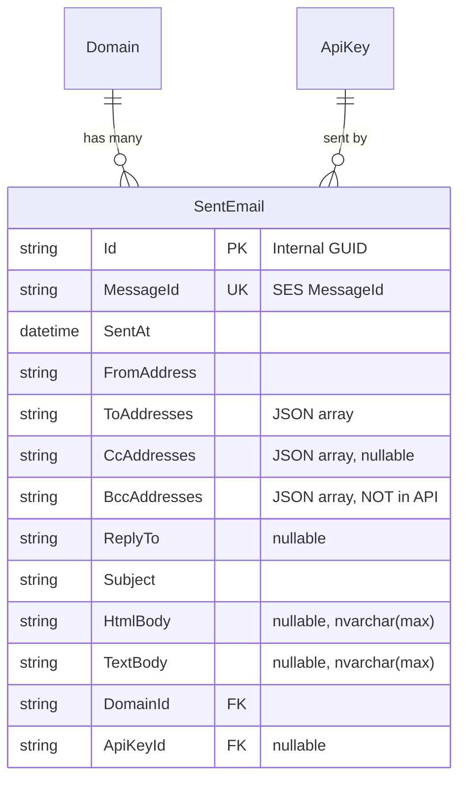

# Store Sent Emails with Configurable Retention

## Enhancement Summary

**Deepened on:** 2026-01-31
**Research agents used:** architecture-strategist, performance-oracle, data-integrity-guardian, security-sentinel, code-simplicity-reviewer, EF Core research, Hangfire research

### Key Improvements
1. **Use internal GUID as PK** instead of SES MessageId for architectural consistency
2. **Add keyset pagination** for scalable list queries
3. **Exclude BCC from API responses** for privacy (store encrypted if needed)
4. **Adaptive batch sizing** in cleanup job for variable load
5. **Explicit projection** in list queries to avoid fetching large body columns

### Critical Considerations Discovered
- BCC visibility in API responses is a privacy violation
- Large HTML bodies (100KB+) require separate storage or explicit projection
- Lock escalation at ~5000 rows affects batch delete sizing
- SES MessageId as PK couples data model to external service

---

## Overview

Add the ability to store all sent emails in the database with their full content. Emails are kept forever by default, but administrators can configure a retention period in days. A Hangfire job will clean up old emails in batches when retention is configured.

## Problem Statement

Currently, SelfMX only stores audit metadata about sent emails (domain, recipient count) but not the actual email content. Users have no way to:
- View what emails were sent through their system
- Debug email delivery issues by reviewing content
- Maintain compliance records of sent communications

## Proposed Solution

1. **New `SentEmail` entity** - Store full email content after successful SES delivery
2. **Configurable retention** - `App__SentEmailRetentionDays` setting (null/0 = keep forever)
3. **Cleanup job** - Hangfire recurring job deletes old emails in batches
4. **API endpoints** - List and view sent emails for domain owners
5. **Documentation** - Update website with configuration and API reference

## Technical Approach

### Entity: SentEmail

```
src/SelfMX.Api/Entities/SentEmail.cs
```

```csharp
namespace SelfMX.Api.Entities;

public class SentEmail
{
    public required string Id { get; set; }           // Internal GUID (not SES MessageId)
    public required string MessageId { get; set; }    // SES MessageId for correlation
    public DateTime SentAt { get; set; } = DateTime.UtcNow;
    public required string FromAddress { get; set; }
    public required string ToAddresses { get; set; }  // JSON array
    public string? CcAddresses { get; set; }          // JSON array
    public string? BccAddresses { get; set; }         // JSON array (NOT returned in API)
    public string? ReplyTo { get; set; }
    public required string Subject { get; set; }
    public string? HtmlBody { get; set; }
    public string? TextBody { get; set; }
    public required string DomainId { get; set; }
    public string? ApiKeyId { get; set; }             // Nullable for admin sends

    // Navigation
    public Domain Domain { get; set; } = null!;
}
```

#### Research Insights: Entity Design

**Best Practices:**
- Use internal GUID as primary key, not external SES MessageId (architectural consistency)
- Add unique index on MessageId for deduplication and webhook correlation
- Store ApiKeyId as nullable FK with `SetNull` delete behavior to preserve audit trail

**Security Consideration:**
- BCC must NOT be returned in API responses - store for audit but never expose
- Consider encrypting BCC column if compliance requires storage

### Database Configuration

Add to `AppDbContext.cs`:

```csharp
public DbSet<SentEmail> SentEmails => Set<SentEmail>();

// In OnModelCreating:
modelBuilder.Entity<SentEmail>(entity =>
{
    entity.HasKey(e => e.Id);
    entity.Property(e => e.Id).HasMaxLength(36);
    entity.Property(e => e.MessageId).HasMaxLength(100).IsRequired();
    entity.Property(e => e.FromAddress).HasMaxLength(320).IsRequired(); // RFC 5321 max
    entity.Property(e => e.ToAddresses).IsRequired();
    entity.Property(e => e.Subject).HasMaxLength(998).IsRequired(); // RFC 5322 limit
    entity.Property(e => e.DomainId).HasMaxLength(36).IsRequired();
    entity.Property(e => e.ApiKeyId).HasMaxLength(36);

    // Large text - explicit nvarchar(max)
    entity.Property(e => e.HtmlBody).HasColumnType("nvarchar(max)");
    entity.Property(e => e.TextBody).HasColumnType("nvarchar(max)");

    // Indexes for cleanup job and queries
    entity.HasIndex(e => e.SentAt);
    entity.HasIndex(e => e.MessageId).IsUnique();
    entity.HasIndex(e => new { e.DomainId, e.SentAt });

    // Covering index for list queries (avoids key lookups)
    // entity.HasIndex(e => new { e.DomainId, e.SentAt })
    //     .IncludeProperties(e => new { e.Id, e.MessageId, e.FromAddress, e.Subject });

    // Foreign key to Domain (no cascade - keep history)
    entity.HasOne(e => e.Domain)
        .WithMany()
        .HasForeignKey(e => e.DomainId)
        .OnDelete(DeleteBehavior.Restrict);
});
```

#### Research Insights: Indexing

**Performance Considerations:**
- Composite index `(DomainId, SentAt DESC)` is critical for list queries
- Include columns in index to avoid key lookups for list queries
- `SentAt` index essential for cleanup job efficiency
- Stay under 4 indexes to keep lock count below 5000 threshold during batch deletes

### Configuration

Add to `AppSettings.cs`:

```csharp
// Sent email retention (null or 0 = keep forever)
public int? SentEmailRetentionDays { get; set; }
```

Environment variable: `App__SentEmailRetentionDays`

### Cleanup Job

```
src/SelfMX.Api/Jobs/CleanupSentEmailsJob.cs
```

```csharp
namespace SelfMX.Api.Jobs;

public class CleanupSentEmailsJob
{
    private readonly IServiceScopeFactory _scopeFactory;
    private readonly IOptions<AppSettings> _appSettings;
    private readonly ILogger<CleanupSentEmailsJob> _logger;

    private const int BaseBatchSize = 1000;
    private const int MaxBatchSize = 5000;
    private const int MaxBatchesPerRun = 500;

    public CleanupSentEmailsJob(
        IServiceScopeFactory scopeFactory,
        IOptions<AppSettings> appSettings,
        ILogger<CleanupSentEmailsJob> logger)
    {
        _scopeFactory = scopeFactory;
        _appSettings = appSettings;
        _logger = logger;
    }

    [DisableConcurrentExecution(timeoutInSeconds: 3600)]
    [AutomaticRetry(Attempts = 3, OnAttemptsExceeded = AttemptsExceededAction.Fail)]
    public async Task ExecuteAsync(CancellationToken ct = default)
    {
        var retentionDays = _appSettings.Value.SentEmailRetentionDays;

        if (retentionDays is null or <= 0)
        {
            _logger.LogDebug("Sent email retention disabled, skipping cleanup");
            return;
        }

        var cutoff = DateTime.UtcNow.AddDays(-retentionDays.Value);
        _logger.LogInformation("Cleaning up sent emails older than {Cutoff}", cutoff);

        int totalDeleted = 0;
        int batchCount = 0;
        int batchSize = BaseBatchSize;
        var stopwatch = Stopwatch.StartNew();

        while (batchCount < MaxBatchesPerRun)
        {
            ct.ThrowIfCancellationRequested();

            using var scope = _scopeFactory.CreateScope();
            var db = scope.ServiceProvider.GetRequiredService<AppDbContext>();

            var batchStart = Stopwatch.StartNew();
            var deleted = await db.SentEmails
                .Where(e => e.SentAt < cutoff)
                .OrderBy(e => e.SentAt)
                .Take(batchSize)
                .ExecuteDeleteAsync(ct);

            if (deleted == 0)
                break;

            totalDeleted += deleted;
            batchCount++;

            // Adaptive batch sizing based on execution time
            var elapsed = batchStart.ElapsedMilliseconds;
            if (elapsed < 500 && batchSize < MaxBatchSize)
                batchSize = Math.Min(batchSize * 2, MaxBatchSize);
            else if (elapsed > 2000 && batchSize > BaseBatchSize)
                batchSize = Math.Max(batchSize / 2, BaseBatchSize);

            if (batchCount % 50 == 0)
            {
                _logger.LogInformation(
                    "Cleanup progress: {Deleted} records in {Batches} batches",
                    totalDeleted, batchCount);
            }

            // Brief pause between batches to reduce lock contention
            await Task.Delay(100, ct);
        }

        _logger.LogInformation(
            "Cleanup complete: {Total} records in {Batches} batches, Duration: {Duration:mm\\:ss}",
            totalDeleted, batchCount, stopwatch.Elapsed);
    }
}
```

Register in `Program.cs`:

```csharp
recurringJobManager.AddOrUpdate<CleanupSentEmailsJob>(
    "cleanup-sent-emails",
    job => job.ExecuteAsync(CancellationToken.None),
    "0 3 * * *",  // Daily at 3 AM UTC
    new RecurringJobOptions { TimeZone = TimeZoneInfo.Utc });
```

#### Research Insights: Cleanup Job

**Best Practices:**
- `[DisableConcurrentExecution]` prevents overlapping runs
- `[AutomaticRetry(Attempts = 3)]` - don't over-retry cleanup jobs
- Adaptive batch sizing scales to data volume
- 100ms delay between batches prevents monopolizing table locks

**Performance Considerations:**
- Stay under 5000 rows per batch to avoid lock escalation
- Order by clustered index direction minimizes page splits
- Schedule during off-peak hours (3 AM)

### Storage in EmailEndpoints

Modify `EmailEndpoints.cs` to store email after successful SES send:

```csharp
// After line 102 (sesService.SendEmailAsync)
var sentEmail = new SentEmail
{
    Id = Guid.NewGuid().ToString(),
    MessageId = messageId,
    FromAddress = request.From,
    ToAddresses = JsonSerializer.Serialize(request.To),
    CcAddresses = request.Cc is { Length: > 0 } ? JsonSerializer.Serialize(request.Cc) : null,
    BccAddresses = request.Bcc is { Length: > 0 } ? JsonSerializer.Serialize(request.Bcc) : null,
    ReplyTo = request.ReplyTo,
    Subject = request.Subject,
    HtmlBody = request.Html,
    TextBody = request.Text,
    DomainId = domain.Id,
    ApiKeyId = user.FindFirst("KeyId")?.Value
};

try
{
    db.SentEmails.Add(sentEmail);
    await db.SaveChangesAsync(ct);
}
catch (Exception ex)
{
    // Log but don't fail - email was already sent
    logger.LogError(ex, "Failed to store sent email {MessageId}", messageId);
}
```

#### Research Insights: Transaction Boundaries

**Data Integrity Consideration:**
- SES send succeeds but DB insert fails = email sent but untracked
- This is acceptable: log the error, return success (email was delivered)
- Alternative: Use outbox pattern for guaranteed storage (adds complexity)

### API Endpoints

```
src/SelfMX.Api/Endpoints/SentEmailEndpoints.cs
```

| Endpoint | Method | Auth | Description |
|----------|--------|------|-------------|
| `/v1/sent-emails` | GET | API Key | List sent emails for accessible domains |
| `/v1/sent-emails/{id}` | GET | API Key | Get sent email by ID |

Query parameters for list:
- `domainId` - Filter by domain
- `from` / `to` - Date range filter
- `cursor` - Keyset pagination cursor (base64 encoded)
- `pageSize` - Items per page (default 50, max 100)

#### Research Insights: API Design

**Security Requirements:**
- NEVER return BccAddresses in API responses
- Verify both domain access AND API key ownership for detail endpoint
- Add audit logging for email content access

**Performance Recommendations:**
- Use keyset (cursor) pagination for scalable list queries
- Never select HtmlBody/TextBody in list queries - explicit projection only
- Return body content only in detail endpoint

**Response DTO (excludes BCC and body for list):**

```csharp
public record SentEmailListItem(
    string Id,
    string MessageId,
    DateTime SentAt,
    string FromAddress,
    string[] To,
    string? Subject,
    string DomainId
);

public record SentEmailDetail(
    string Id,
    string MessageId,
    DateTime SentAt,
    string FromAddress,
    string[] To,
    string[]? Cc,
    // NO BCC - privacy requirement
    string? ReplyTo,
    string Subject,
    string? HtmlBody,
    string? TextBody,
    string DomainId
);
```

**Keyset Pagination Implementation:**

```csharp
public async Task<CursorPagedResult<SentEmailListItem>> ListAsync(
    ClaimsPrincipal user,
    string? domainId,
    DateTime? from,
    DateTime? to,
    string? cursor,
    int pageSize = 50,
    CancellationToken ct = default)
{
    pageSize = Math.Clamp(pageSize, 1, 100);

    var allowedDomains = user.FindAll("AllowedDomain").Select(c => c.Value).ToList();
    var isAdmin = user.FindFirst("ActorType")?.Value == "admin";

    var query = _db.SentEmails.AsNoTracking();

    // Authorization filter
    if (!isAdmin)
        query = query.Where(e => allowedDomains.Contains(e.DomainId));

    if (!string.IsNullOrEmpty(domainId))
        query = query.Where(e => e.DomainId == domainId);

    if (from.HasValue)
        query = query.Where(e => e.SentAt >= from.Value);
    if (to.HasValue)
        query = query.Where(e => e.SentAt <= to.Value);

    // Keyset pagination
    if (!string.IsNullOrEmpty(cursor))
    {
        var c = Cursor.Decode(cursor);
        if (c != null)
        {
            query = query.Where(e =>
                e.SentAt < c.SentAt ||
                (e.SentAt == c.SentAt && e.Id.CompareTo(c.Id) < 0));
        }
    }

    // Explicit projection - never fetch body columns
    var items = await query
        .OrderByDescending(e => e.SentAt)
        .ThenByDescending(e => e.Id)
        .Take(pageSize + 1)
        .Select(e => new SentEmailListItem(
            e.Id,
            e.MessageId,
            e.SentAt,
            e.FromAddress,
            JsonSerializer.Deserialize<string[]>(e.ToAddresses)!,
            e.Subject,
            e.DomainId
        ))
        .ToListAsync(ct);

    var hasMore = items.Count > pageSize;
    if (hasMore) items.RemoveAt(items.Count - 1);

    var lastItem = items.LastOrDefault();
    var nextCursor = hasMore && lastItem != null
        ? new Cursor(lastItem.Id, lastItem.SentAt).Encode()
        : null;

    return new CursorPagedResult<SentEmailListItem>(items, nextCursor, hasMore);
}
```

### ERD



## Acceptance Criteria

### Functional Requirements

- [ ] All successfully sent emails are stored in the database
- [ ] Emails include: from, to, cc, bcc, reply-to, subject, html body, text body
- [ ] `App__SentEmailRetentionDays` configures retention (null/0 = keep forever)
- [ ] Cleanup job runs daily and deletes old emails in adaptive batches
- [ ] API key holders can list/view sent emails for their authorized domains
- [ ] Admin can list/view all sent emails
- [ ] **BCC is NEVER returned in API responses**

### Non-Functional Requirements

- [ ] Storage failure after SES send does not fail the API request
- [ ] Cleanup job is idempotent and handles restarts gracefully
- [ ] Cleanup job uses `[DisableConcurrentExecution]` to prevent overlap
- [ ] List queries use keyset pagination for O(1) performance at any depth
- [ ] List queries never select body columns (explicit projection)
- [ ] Indexes on `SentAt`, `MessageId` (unique), and `(DomainId, SentAt)`

### Testing

- [ ] Unit test: SentEmail entity configuration
- [ ] Unit test: CleanupSentEmailsJob respects retention setting
- [ ] Unit test: CleanupSentEmailsJob skips when retention disabled
- [ ] Unit test: BCC not included in list/detail responses
- [ ] Integration test: Email send stores SentEmail record
- [ ] Integration test: GET /v1/sent-emails returns domain-scoped results
- [ ] Integration test: Keyset pagination returns consistent results

## Files to Create/Modify

### Create
- `src/SelfMX.Api/Entities/SentEmail.cs`
- `src/SelfMX.Api/Jobs/CleanupSentEmailsJob.cs`
- `src/SelfMX.Api/Endpoints/SentEmailEndpoints.cs`
- `src/SelfMX.Api/Contracts/Responses/SentEmailResponse.cs`
- `tests/SelfMX.Api.Tests/CleanupSentEmailsJob.Tests.cs`

### Modify
- `src/SelfMX.Api/Data/AppDbContext.cs` - Add DbSet and configuration
- `src/SelfMX.Api/Settings/AppSettings.cs` - Add SentEmailRetentionDays
- `src/SelfMX.Api/Endpoints/EmailEndpoints.cs` - Store email after send
- `src/SelfMX.Api/Program.cs` - Register cleanup job
- `website/src/content/pages/install.md` - Document retention setting
- `website/src/content/pages/api.md` - Document sent-emails endpoints
- `website/src/content/pages/backups.md` - Note sent emails in "What Gets Backed Up"

## Documentation Updates

### install.md - Optional Settings table

Add row:
| `App__SentEmailRetentionDays` | | Days to keep sent emails (empty = forever) |

### api.md - New section

```markdown
## Sent Emails

### List Sent Emails

**GET** `/v1/sent-emails`

Returns sent emails for domains accessible by the API key.

#### Query Parameters

| Parameter | Type | Description |
|-----------|------|-------------|
| `domainId` | string | Filter by domain ID |
| `from` | datetime | Start date (ISO 8601) |
| `to` | datetime | End date (ISO 8601) |
| `cursor` | string | Pagination cursor from previous response |
| `pageSize` | integer | Items per page (default: 50, max: 100) |

#### Response

```json
{
  "data": [
    {
      "id": "d5f2a3b1-...",
      "messageId": "msg_xxxxxxxxxxxx",
      "sentAt": "2026-01-15T10:30:00Z",
      "fromAddress": "hello@example.com",
      "to": ["user@example.com"],
      "subject": "Welcome!",
      "domainId": "d5f2a3b1-..."
    }
  ],
  "nextCursor": "eyJpZCI6Ii...",
  "hasMore": true
}
```

### Get Sent Email

**GET** `/v1/sent-emails/{id}`

Returns a single sent email by ID, including body content.

> **Note:** BCC recipients are not included in the response for privacy.
```

### backups.md - What Gets Backed Up

Add:
- **Sent Emails** - Full email content (from, to, subject, body) if retention allows

## References

### Internal
- Entity pattern: `src/SelfMX.Api/Entities/AuditLog.cs`
- Job pattern: `src/SelfMX.Api/Jobs/VerifyDomainsJob.cs`
- Endpoint pattern: `src/SelfMX.Api/Endpoints/DomainEndpoints.cs`
- Settings pattern: `src/SelfMX.Api/Settings/AppSettings.cs`
- Auth scoping: `src/SelfMX.Api/Services/ApiKeyService.cs:150-158`

### Existing send flow
- `src/SelfMX.Api/Endpoints/EmailEndpoints.cs:93-114`

### External References
- [EF Core Pagination Docs](https://github.com/dotnet/entityframework.docs/blob/main/entity-framework/core/querying/pagination.md)
- [Hangfire Best Practices](https://github.com/hangfireio/hangfire.documentation/blob/main/best-practices.md)
- [SQL Server Batch Delete Performance](https://www.brentozar.com/archive/2018/04/how-to-delete-just-some-rows-from-a-really-big-table/)
