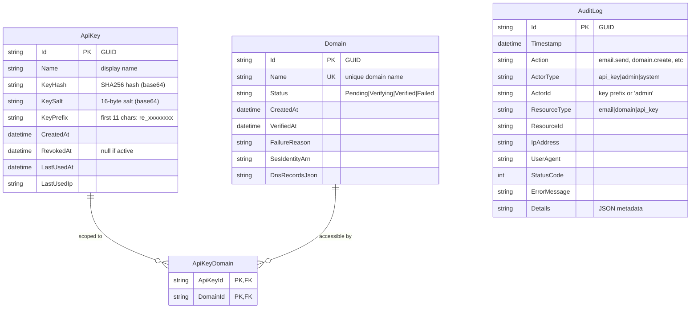

# feat: Multi-tenant API Keys with Audit Trail

## Enhancement Summary

**Deepened on:** 2026-01-22
**Reviewed on:** 2026-01-22 (DHH, Kieran, Code Simplicity reviewers)
**Sections enhanced:** 6 (Authentication, Key Validation, Audit Logging, Data Model, Services, Security)

### Key Improvements

1. **CRITICAL: Replace BCrypt with SHA256+Salt for API keys** - BCrypt takes ~100ms per request; SHA256 takes ~0.005ms. Store `SHA256(key + salt)` with a random salt per key.
2. **CRITICAL: Constant-time key validation** - Prevent timing attacks by always performing hash comparison, even when no key matches prefix.
3. **CRITICAL: Add programmatic admin auth** - Password-only admin auth blocks agent access. Add API key-based admin authentication.
4. **HIGH: Buffered async audit logging** - Use `Channel<T>` with background consumer to batch writes and prevent request blocking.
5. **HIGH: Separate audit database** - SQLite file-level locking causes contention; use separate `.db` file for audit logs.
6. **HIGH: Restrict cascading deletes** - Use `DeleteBehavior.Restrict` on Domain→ApiKeyDomain to prevent orphaned keys.
7. **HIGH: Rate limiting** - Fixed window for login (5/min), sliding window for API (100/min).

### Post-Review Fixes (Kieran)

- **FIX: Service lifetime mismatch** - `AuditService` (Singleton) uses `IServiceScopeFactory` to create scoped `AuditDbContext` instances
- **FIX: Missing `_lastUsedUpdater`** - Inlined update using `ExecuteUpdateAsync` with separate scope
- **FIX: ERD documentation** - Updated to show SHA256 hash + salt (was incorrectly showing BCrypt)
- **FIX: Interface consistency** - Removed all service interfaces, using concrete types throughout
- **FIX: Cookie name casing** - Changed from "Selfmx.Admin" to "SelfMX.Admin"
- **REMOVED: AuditRetentionService** - Deferred; can add manual cleanup endpoint later if needed

---

## Overview

Replace the single-key authentication system with a multi-tenant API key management system where admins can create multiple named API keys, each scoped to specific domains. Add password-protected admin UI with 30-day sessions and comprehensive audit logging for all operations.

**Key Changes:**
- Multiple named API keys with domain scoping (Resend SDK compatible)
- Password-protected admin access with cookie-based 30-day sessions
- Full audit trail for API calls and admin actions

## Problem Statement / Motivation

The current single API key model (`AppSettings.ApiKeyHash`) is insufficient for production use:

1. **No key rotation** - Compromised key requires config change and restart
2. **No granular permissions** - Single key has access to all domains
3. **No audit trail** - No visibility into who did what
4. **No admin protection** - API endpoints accessible without session management

## Proposed Solution

### Architecture Overview

```
┌─────────────────────────────────────────────────────────────────────┐
│                         SELFMX ARCHITECTURE                         │
├─────────────────────────────────────────────────────────────────────┤
│                                                                     │
│  ┌─────────────┐     ┌─────────────┐     ┌─────────────┐           │
│  │ Admin UI    │     │ Resend SDK  │     │ Background  │           │
│  │ (Browser)   │     │ (API Client)│     │ Jobs        │           │
│  └──────┬──────┘     └──────┬──────┘     └──────┬──────┘           │
│         │                   │                   │                   │
│         │ Cookie Auth       │ Bearer Token      │ System            │
│         │ (30-day)          │ (API Key)         │                   │
│         ▼                   ▼                   ▼                   │
│  ┌─────────────────────────────────────────────────────┐           │
│  │              Authentication Layer                    │           │
│  │  ┌─────────────┐  ┌─────────────┐  ┌─────────────┐  │           │
│  │  │ Cookie Auth │  │ API Key Auth│  │ System Auth │  │           │
│  │  │ (Admin)     │  │ (Multi-key) │  │ (Jobs)      │  │           │
│  │  └─────────────┘  └─────────────┘  └─────────────┘  │           │
│  └─────────────────────────────────────────────────────┘           │
│                              │                                      │
│                              ▼                                      │
│  ┌─────────────────────────────────────────────────────┐           │
│  │              Authorization Layer                     │           │
│  │  - Admin: Full access to all endpoints              │           │
│  │  - API Key: Scoped to allowed domains               │           │
│  │  - System: Background job operations                │           │
│  └─────────────────────────────────────────────────────┘           │
│                              │                                      │
│                              ▼                                      │
│  ┌─────────────────────────────────────────────────────┐           │
│  │              Audit Logging Middleware                │           │
│  │  - Logs all requests (success/failure)              │           │
│  │  - Captures actor, action, resource, outcome        │           │
│  └─────────────────────────────────────────────────────┘           │
│                              │                                      │
│                              ▼                                      │
│  ┌─────────────────────────────────────────────────────┐           │
│  │                   Business Logic                     │           │
│  │  DomainService │ ApiKeyService │ AuditService       │           │
│  └─────────────────────────────────────────────────────┘           │
│                              │                                      │
│                              ▼                                      │
│  ┌─────────────────────────────────────────────────────┐           │
│  │                   Data Layer (SQLite)                │           │
│  │  Domains │ ApiKeys │ ApiKeyDomains │ AuditLogs      │           │
│  └─────────────────────────────────────────────────────┘           │
│                                                                     │
└─────────────────────────────────────────────────────────────────────┘
```

### Entity Relationship Diagram



## Technical Approach

### Phase 1: Data Model & Migrations

#### New Entities

**`src/SelfMX.Api/Entities/ApiKey.cs`**
```csharp
public class ApiKey
{
    public required string Id { get; set; }
    public required string Name { get; set; }
    public required string KeyHash { get; set; }      // SHA256(key + salt) - NOT BCrypt (too slow for per-request)
    public required string KeySalt { get; set; }      // Random 16-byte salt per key
    public required string KeyPrefix { get; set; }    // "re_xxxxxxxx" (first 11 chars)
    public DateTime CreatedAt { get; set; } = DateTime.UtcNow;
    public DateTime? RevokedAt { get; set; }
    public DateTime? LastUsedAt { get; set; }
    public string? LastUsedIp { get; set; }

    // Navigation
    public ICollection<ApiKeyDomain> AllowedDomains { get; set; } = [];
}
```

### Research Insights: Key Storage

**Why SHA256 instead of BCrypt for API keys:**
- BCrypt: ~100ms per verify (designed to be slow)
- SHA256: ~0.005ms per verify
- API keys are high-entropy (35+ chars), don't need slow hash
- BCrypt is for LOW-entropy passwords; API keys are cryptographically random

**Implementation:**
```csharp
// Key generation
var salt = RandomNumberGenerator.GetBytes(16);
var hash = SHA256.HashData(Encoding.UTF8.GetBytes(plainTextKey + Convert.ToBase64String(salt)));

// Key validation (constant-time)
var expectedHash = SHA256.HashData(Encoding.UTF8.GetBytes(providedKey + Convert.ToBase64String(storedSalt)));
return CryptographicOperations.FixedTimeEquals(expectedHash, storedHash);
```

**Keep BCrypt for admin password** - Admin password is user-chosen, low-entropy, needs slow hash.

**`src/SelfMX.Api/Entities/ApiKeyDomain.cs`**
```csharp
public class ApiKeyDomain
{
    public required string ApiKeyId { get; set; }
    public required string DomainId { get; set; }

    // Navigation
    public ApiKey ApiKey { get; set; } = null!;
    public Domain Domain { get; set; } = null!;
}
```

**`src/SelfMX.Api/Entities/AuditLog.cs`**
```csharp
public class AuditLog
{
    public required string Id { get; set; }
    public DateTime Timestamp { get; set; } = DateTime.UtcNow;
    public required string Action { get; set; }       // "email.send", "api_key.create"
    public required string ActorType { get; set; }    // "api_key", "admin", "system"
    public string? ActorId { get; set; }              // Key prefix or null for admin
    public required string ResourceType { get; set; } // "email", "domain", "api_key"
    public string? ResourceId { get; set; }
    public string? IpAddress { get; set; }
    public string? UserAgent { get; set; }
    public int StatusCode { get; set; }
    public string? ErrorMessage { get; set; }
    public string? Details { get; set; }              // JSON blob
}
```

#### DbContext Updates

**`src/SelfMX.Api/Data/AppDbContext.cs`**
```csharp
public DbSet<ApiKey> ApiKeys => Set<ApiKey>();
public DbSet<ApiKeyDomain> ApiKeyDomains => Set<ApiKeyDomain>();
public DbSet<AuditLog> AuditLogs => Set<AuditLog>();

// In OnModelCreating:
modelBuilder.Entity<ApiKey>(entity =>
{
    entity.HasKey(e => e.Id);
    entity.Property(e => e.Id).HasMaxLength(36);
    entity.Property(e => e.Name).HasMaxLength(100).IsRequired();
    entity.Property(e => e.KeyHash).HasMaxLength(60).IsRequired();
    entity.Property(e => e.KeyPrefix).HasMaxLength(11).IsRequired();
    entity.HasIndex(e => e.KeyPrefix);  // For quick lookup
});

modelBuilder.Entity<ApiKeyDomain>(entity =>
{
    entity.HasKey(e => new { e.ApiKeyId, e.DomainId });
    entity.HasOne(e => e.ApiKey)
        .WithMany(k => k.AllowedDomains)
        .HasForeignKey(e => e.ApiKeyId)
        .OnDelete(DeleteBehavior.Cascade);  // OK: deleting key removes scopes
    entity.HasOne(e => e.Domain)
        .WithMany()
        .HasForeignKey(e => e.DomainId)
        .OnDelete(DeleteBehavior.Restrict); // CRITICAL: prevent orphaned keys
});

// Research Insight: Data Integrity
// Using Restrict on Domain deletion prevents:
// 1. API keys silently losing access to domains
// 2. Orphaned ApiKeyDomain rows
// 3. Keys that appear valid but can't send to any domain
// Admin must explicitly remove domain from all keys before deleting domain.

modelBuilder.Entity<AuditLog>(entity =>
{
    entity.HasKey(e => e.Id);
    entity.Property(e => e.Id).HasMaxLength(36);
    entity.Property(e => e.Action).HasMaxLength(50).IsRequired();
    entity.Property(e => e.ActorType).HasMaxLength(20).IsRequired();
    entity.Property(e => e.ResourceType).HasMaxLength(50).IsRequired();
    entity.HasIndex(e => e.Timestamp);
    entity.HasIndex(e => new { e.ActorType, e.ActorId });
});
```

### Phase 2: Authentication Refactor

### Research Insights: Authentication Architecture

**Agent-Native Critical Gap Identified:**
Password-only admin auth blocks programmatic access. Agents cannot enter passwords.

**Solution: Dual admin authentication**
1. **Cookie auth** (for browser UI) - password → 30-day session
2. **Admin API key** (for agents) - special key with `admin` scope

```csharp
// Admin API key format: re_admin_xxxxxxxx
// Has ActorType="admin" claim, not domain-scoped
```

**Security Considerations:**
- Admin API keys should be rare (1-2 max)
- Audit all admin key usage prominently
- Consider requiring MFA for admin key creation

#### Settings Updates

**`src/SelfMX.Api/Settings/AppSettings.cs`**
```csharp
public class AppSettings
{
    // Legacy - keep for backward compatibility during migration
    public string? ApiKeyHash { get; set; }

    // New admin password (BCrypt hash) - for browser UI login
    public required string AdminPasswordHash { get; set; }

    // Session settings
    public int SessionExpirationDays { get; set; } = 30;

    // Rate limiting
    public int MaxLoginAttemptsPerMinute { get; set; } = 5;
    public int MaxApiRequestsPerMinute { get; set; } = 100;

    // Existing
    public TimeSpan VerificationTimeout { get; set; } = TimeSpan.FromHours(72);
    public TimeSpan VerificationPollInterval { get; set; } = TimeSpan.FromMinutes(5);
}
```

### Research Insights: Rate Limiting

**Identified Vulnerabilities:**
- Prefix enumeration attack: attacker tries many prefixes to find valid keys
- Brute force login attempts

**Mitigation:**
```csharp
// Add to Program.cs
builder.Services.AddRateLimiter(options =>
{
    options.AddFixedWindowLimiter("login", opt =>
    {
        opt.Window = TimeSpan.FromMinutes(1);
        opt.PermitLimit = 5;
        opt.QueueLimit = 0;
    });

    options.AddSlidingWindowLimiter("api", opt =>
    {
        opt.Window = TimeSpan.FromMinutes(1);
        opt.PermitLimit = 100;
        opt.SegmentsPerWindow = 6;
    });
});
```

#### Dual Authentication Handler

**`src/SelfMX.Api/Authentication/MultiAuthHandler.cs`**
```csharp
// Policy scheme to select between Cookie and ApiKey auth
builder.Services.AddAuthentication(options =>
{
    options.DefaultScheme = "Multi";
    options.DefaultChallengeScheme = "Multi";
})
.AddCookie("Cookie", options =>
{
    options.LoginPath = "/admin/login";
    options.ExpireTimeSpan = TimeSpan.FromDays(30);
    options.SlidingExpiration = true;
    options.Cookie.HttpOnly = true;
    options.Cookie.SecurePolicy = CookieSecurePolicy.Always;
    options.Cookie.SameSite = SameSiteMode.Strict;
    options.Cookie.Name = "SelfMX.Admin";
})
.AddScheme<AuthenticationSchemeOptions, ApiKeyAuthHandler>("ApiKey", null)
.AddPolicyScheme("Multi", "Cookie or API Key", options =>
{
    options.ForwardDefaultSelector = context =>
    {
        // API key takes precedence if present
        if (context.Request.Headers.ContainsKey("Authorization"))
            return "ApiKey";
        return "Cookie";
    };
});
```

#### Updated API Key Handler

**`src/SelfMX.Api/Authentication/ApiKeyAuthHandler.cs`**
```csharp
protected override async Task<AuthenticateResult> HandleAuthenticateAsync()
{
    if (!Request.Headers.TryGetValue("Authorization", out var authHeader))
        return AuthenticateResult.NoResult();

    var headerValue = authHeader.ToString();
    if (!headerValue.StartsWith("Bearer ", StringComparison.OrdinalIgnoreCase))
        return AuthenticateResult.NoResult();

    var apiKey = headerValue[7..];

    // Validate against database
    var keyInfo = await _apiKeyService.ValidateAsync(apiKey, Context.Connection.RemoteIpAddress?.ToString());

    if (keyInfo is null)
    {
        _logger.LogWarning("Auth failed: invalid key, IP={Ip}", Context.Connection.RemoteIpAddress);
        return AuthenticateResult.Fail("Invalid API key");
    }

    if (keyInfo.RevokedAt.HasValue)
    {
        _logger.LogWarning("Auth failed: revoked key {Prefix}, IP={Ip}", keyInfo.KeyPrefix, Context.Connection.RemoteIpAddress);
        return AuthenticateResult.Fail("API key has been revoked");
    }

    var claims = new List<Claim>
    {
        new(ClaimTypes.NameIdentifier, keyInfo.Id),
        new(ClaimTypes.Name, keyInfo.Name),
        new("KeyPrefix", keyInfo.KeyPrefix),
        new("ActorType", "api_key"),
    };

    // Add allowed domain IDs as claims
    foreach (var domain in keyInfo.AllowedDomains)
    {
        claims.Add(new Claim("AllowedDomain", domain.DomainId));
    }

    var identity = new ClaimsIdentity(claims, Scheme.Name);
    var principal = new ClaimsPrincipal(identity);
    var ticket = new AuthenticationTicket(principal, Scheme.Name);

    return AuthenticateResult.Success(ticket);
}
```

### Phase 3: Services

### Research Insight: Service Pattern

**Follow existing DomainService pattern - no interfaces.**
The codebase uses concrete services directly. Interfaces add no value here.

#### API Key Service

**`src/SelfMX.Api/Services/ApiKeyService.cs`**
```csharp
public class ApiKeyService(AppDbContext db, IServiceScopeFactory scopeFactory, ILogger<ApiKeyService> logger)
{
    private readonly AppDbContext _db = db;
    private readonly IServiceScopeFactory _scopeFactory = scopeFactory;
    private readonly ILogger<ApiKeyService> _logger = logger;
    public async Task<(ApiKey Key, string PlainTextKey)> CreateAsync(
        string name, string[] domainIds, CancellationToken ct = default)
    {
        // Generate key: re_ + 32 random chars (base62)
        var randomBytes = RandomNumberGenerator.GetBytes(24);
        var randomPart = Convert.ToBase64String(randomBytes)
            .Replace("+", "").Replace("/", "").Replace("=", "")[..32];
        var plainTextKey = $"re_{randomPart}";
        var keyPrefix = plainTextKey[..11]; // "re_xxxxxxxx"

        // Use SHA256 + salt (NOT BCrypt - too slow for per-request validation)
        var salt = RandomNumberGenerator.GetBytes(16);
        var keyHash = SHA256.HashData(Encoding.UTF8.GetBytes(plainTextKey + Convert.ToBase64String(salt)));

        var apiKey = new ApiKey
        {
            Id = Guid.NewGuid().ToString(),
            Name = name,
            KeyHash = Convert.ToBase64String(keyHash),
            KeySalt = Convert.ToBase64String(salt),
            KeyPrefix = keyPrefix,
        };

        // Add domain scopes
        foreach (var domainId in domainIds)
        {
            apiKey.AllowedDomains.Add(new ApiKeyDomain
            {
                ApiKeyId = apiKey.Id,
                DomainId = domainId
            });
        }

        _db.ApiKeys.Add(apiKey);
        await _db.SaveChangesAsync(ct);

        return (apiKey, plainTextKey);
    }

    public async Task<ApiKey?> ValidateAsync(string plainTextKey, string? ipAddress, CancellationToken ct = default)
    {
        if (!plainTextKey.StartsWith("re_") || plainTextKey.Length < 11)
            return null;

        var prefix = plainTextKey[..11];

        // Find by prefix first (indexed), then verify hash
        var candidate = await _db.ApiKeys
            .Include(k => k.AllowedDomains)
            .Where(k => k.KeyPrefix == prefix && k.RevokedAt == null)
            .FirstOrDefaultAsync(ct);

        // CRITICAL: Always perform hash comparison to prevent timing attacks
        // Even if no candidate found, compare against dummy hash
        var keyBytes = Encoding.UTF8.GetBytes(plainTextKey);
        var saltBytes = candidate?.KeySalt is not null
            ? Convert.FromBase64String(candidate.KeySalt)
            : new byte[16]; // Dummy salt
        var expectedHash = candidate?.KeyHash is not null
            ? Convert.FromBase64String(candidate.KeyHash)
            : new byte[32]; // Dummy hash

        var computedHash = SHA256.HashData(Encoding.UTF8.GetBytes(plainTextKey + Convert.ToBase64String(saltBytes)));

        // Constant-time comparison - CRITICAL for timing attack prevention
        if (!CryptographicOperations.FixedTimeEquals(computedHash, expectedHash) || candidate is null)
        {
            return null;
        }

        // Update last used - use separate scope to avoid change tracker issues
        // This runs in background but with proper DbContext lifecycle
        _ = Task.Run(async () =>
        {
            try
            {
                using var scope = _scopeFactory.CreateScope();
                var scopedDb = scope.ServiceProvider.GetRequiredService<AppDbContext>();
                await scopedDb.ApiKeys
                    .Where(k => k.Id == candidate.Id)
                    .ExecuteUpdateAsync(s => s
                        .SetProperty(k => k.LastUsedAt, DateTime.UtcNow)
                        .SetProperty(k => k.LastUsedIp, ipAddress));
            }
            catch (Exception ex)
            {
                _logger.LogWarning(ex, "Failed to update LastUsedAt for key {Prefix}", candidate.KeyPrefix);
            }
        });

        return candidate;
    }

    // Research Insight: Fire-and-forget SaveChangesAsync Problem
    // NEVER do: _ = _db.SaveChangesAsync(CancellationToken.None);
    // This corrupts EF Core's change tracker if another operation starts
    // before the save completes.
    // FIX: Use ExecuteUpdateAsync with a separate scoped DbContext.

    public bool CanAccessDomain(ClaimsPrincipal user, string domainId)
    {
        // Admin can access all
        if (user.FindFirst("ActorType")?.Value == "admin")
            return true;

        // Check if domain is in allowed list
        return user.FindAll("AllowedDomain").Any(c => c.Value == domainId);
    }
}
```

#### Audit Service

### Research Insights: Audit Logging Architecture

**Performance Problems Identified:**
1. Synchronous `SaveChangesAsync` blocks request completion
2. SQLite file-level locking causes contention with main DB
3. High-volume audit writes degrade API performance

**Solution: Buffered Async Audit Logging with Separate Database**

```
Request → AuditService.Log() → Channel<AuditEntry> → Background Consumer → Batch Insert → audit.db
           (non-blocking)        (bounded 10k)         (every 100ms or 50 items)
```

**`src/SelfMX.Api/Services/AuditService.cs`**
```csharp
public class AuditService(
    IServiceScopeFactory scopeFactory,  // FIX: Use scope factory for Scoped DbContext
    IHttpContextAccessor httpContextAccessor,
    ILogger<AuditService> logger) : IHostedService
{
    private readonly Channel<AuditLog> _channel = Channel.CreateBounded<AuditLog>(10_000);
    private Task? _consumerTask;

    // Non-blocking log - never awaits database
    public void Log(AuditEntry entry)
    {
        var log = new AuditLog
        {
            Id = Guid.NewGuid().ToString(),
            Action = entry.Action,
            ActorType = entry.ActorType,
            ActorId = entry.ActorId,
            ResourceType = entry.ResourceType,
            ResourceId = entry.ResourceId,
            StatusCode = entry.StatusCode,
            ErrorMessage = entry.ErrorMessage,
            Details = entry.Details is not null ? JsonSerializer.Serialize(entry.Details) : null,
            IpAddress = httpContextAccessor.HttpContext?.Connection.RemoteIpAddress?.ToString(),
            UserAgent = httpContextAccessor.HttpContext?.Request.Headers.UserAgent.ToString()
        };

        // TryWrite returns false if channel full - log warning but don't block
        if (!_channel.Writer.TryWrite(log))
        {
            logger.LogWarning("Audit channel full, dropping entry: {Action}", entry.Action);
        }
    }

    // Background consumer batches writes
    public Task StartAsync(CancellationToken ct)
    {
        _consumerTask = ConsumeAsync(ct);
        return Task.CompletedTask;
    }

    public async Task StopAsync(CancellationToken ct)
    {
        _channel.Writer.Complete();
        if (_consumerTask is not null)
            await _consumerTask;
    }

    private async Task ConsumeAsync(CancellationToken ct)
    {
        var batch = new List<AuditLog>(50);

        while (await _channel.Reader.WaitToReadAsync(ct))
        {
            // Drain available items up to batch size
            while (_channel.Reader.TryRead(out var log) && batch.Count < 50)
            {
                batch.Add(log);
            }

            if (batch.Count > 0)
            {
                // FIX: Create scope for each batch to get fresh DbContext
                using var scope = scopeFactory.CreateScope();
                var auditDb = scope.ServiceProvider.GetRequiredService<AuditDbContext>();

                auditDb.AuditLogs.AddRange(batch);
                await auditDb.SaveChangesAsync(ct);
                batch.Clear();
            }
        }
    }

    // Query interface - also uses scoped DbContext
    public async Task<(AuditLog[] Items, int Total)> ListAsync(
        int page, int limit,
        string? action = null,
        string? actorId = null,
        DateTime? from = null,
        DateTime? to = null,
        CancellationToken ct = default)
    {
        using var scope = scopeFactory.CreateScope();
        var auditDb = scope.ServiceProvider.GetRequiredService<AuditDbContext>();

        var query = auditDb.AuditLogs.AsQueryable();

        if (action is not null)
            query = query.Where(l => l.Action == action);
        if (actorId is not null)
            query = query.Where(l => l.ActorId == actorId);
        if (from.HasValue)
            query = query.Where(l => l.Timestamp >= from.Value);
        if (to.HasValue)
            query = query.Where(l => l.Timestamp <= to.Value);

        var total = await query.CountAsync(ct);
        var items = await query
            .OrderByDescending(l => l.Timestamp)
            .Skip((page - 1) * limit)
            .Take(limit)
            .ToArrayAsync(ct);

        return (items, total);
    }
}
```

**Separate Audit Database:**
```csharp
// In Program.cs
builder.Services.AddDbContext<AuditDbContext>(options =>
    options.UseSqlite("Data Source=audit.db"));
```

**Benefits:**
- Request latency: ~0ms (non-blocking write to channel)
- No SQLite lock contention with main database
- Batch inserts are 10-50x faster than individual inserts
- Graceful degradation when overloaded (drops oldest entries)

**`src/SelfMX.Api/Services/AuditEntry.cs`** (simple record, no interface needed)
```csharp
public record AuditEntry(
    string Action,
    string ActorType,
    string? ActorId,
    string ResourceType,
    string? ResourceId,
    int StatusCode,
    string? ErrorMessage = null,
    object? Details = null
);
```

### Phase 4: Endpoints

#### Admin Authentication Endpoints

**`src/SelfMX.Api/Endpoints/AdminEndpoints.cs`**
```csharp
public static class AdminEndpoints
{
    public static RouteGroupBuilder MapAdminEndpoints(this RouteGroupBuilder group)
    {
        var admin = group.MapGroup("/admin");

        admin.MapPost("/login", Login).AllowAnonymous();
        admin.MapPost("/logout", Logout);
        admin.MapGet("/me", GetCurrentAdmin);

        return group;
    }

    private static async Task<Results<Ok, UnauthorizedHttpResult>> Login(
        LoginRequest request,
        IOptions<AppSettings> settings,
        HttpContext context)
    {
        if (!BCrypt.Net.BCrypt.Verify(request.Password, settings.Value.AdminPasswordHash))
        {
            return TypedResults.Unauthorized();
        }

        var claims = new List<Claim>
        {
            new(ClaimTypes.Name, "admin"),
            new("ActorType", "admin"),
        };

        var identity = new ClaimsIdentity(claims, "Cookie");
        var principal = new ClaimsPrincipal(identity);

        await context.SignInAsync("Cookie", principal, new AuthenticationProperties
        {
            IsPersistent = true,
            ExpiresUtc = DateTimeOffset.UtcNow.AddDays(settings.Value.SessionExpirationDays)
        });

        return TypedResults.Ok();
    }

    private static async Task<Ok> Logout(HttpContext context)
    {
        await context.SignOutAsync("Cookie");
        return TypedResults.Ok();
    }
}

public record LoginRequest(string Password);
```

#### API Key Management Endpoints

**`src/SelfMX.Api/Endpoints/ApiKeyEndpoints.cs`**
```csharp
public static class ApiKeyEndpoints
{
    public static RouteGroupBuilder MapApiKeyEndpoints(this RouteGroupBuilder group)
    {
        var keys = group.MapGroup("/api-keys");

        keys.MapGet("/", ListApiKeys);
        keys.MapPost("/", CreateApiKey);
        keys.MapGet("/{id}", GetApiKey);
        keys.MapDelete("/{id}", RevokeApiKey);

        return group;
    }

    private static async Task<Results<Ok<PaginatedResponse<ApiKeyResponse>>, BadRequest<object>>> ListApiKeys(
        ApiKeyService apiKeyService,
        int page = 1,
        int limit = 20,
        CancellationToken ct = default)
    {
        var (items, total) = await apiKeyService.ListAsync(page, limit, ct);
        var responses = items.Select(ApiKeyResponse.FromEntity).ToArray();
        return TypedResults.Ok(new PaginatedResponse<ApiKeyResponse>(responses, page, limit, total));
    }

    private static async Task<Results<Created<ApiKeyCreatedResponse>, BadRequest<object>>> CreateApiKey(
        CreateApiKeyRequest request,
        ApiKeyService apiKeyService,
        AuditService auditService,
        ClaimsPrincipal user,
        CancellationToken ct = default)
    {
        if (string.IsNullOrWhiteSpace(request.Name) || request.DomainIds.Length == 0)
            return TypedResults.BadRequest(ApiError.InvalidRequest.ToResponse());

        var (key, plainTextKey) = await apiKeyService.CreateAsync(request.Name, request.DomainIds, ct);

        auditService.Log(new AuditEntry(
            Action: "api_key.create",
            ActorType: user.FindFirst("ActorType")?.Value ?? "admin",
            ActorId: user.FindFirst("KeyPrefix")?.Value,
            ResourceType: "api_key",
            ResourceId: key.Id,
            StatusCode: 201,
            Details: new { key.Name, DomainCount = request.DomainIds.Length }
        );

        // Return the plain text key ONCE
        return TypedResults.Created(
            $"/v1/api-keys/{key.Id}",
            new ApiKeyCreatedResponse(key.Id, key.Name, plainTextKey, key.KeyPrefix, key.CreatedAt)
        );
    }

    private static async Task<Results<Ok, NotFound<object>>> RevokeApiKey(
        string id,
        ApiKeyService apiKeyService,
        AuditService auditService,
        ClaimsPrincipal user,
        CancellationToken ct = default)
    {
        var key = await apiKeyService.GetByIdAsync(id, ct);
        if (key is null)
            return TypedResults.NotFound(ApiError.NotFound.ToResponse());

        await apiKeyService.RevokeAsync(id, ct);

        auditService.Log(new AuditEntry(
            Action: "api_key.revoke",
            ActorType: user.FindFirst("ActorType")?.Value ?? "admin",
            ActorId: user.FindFirst("KeyPrefix")?.Value,
            ResourceType: "api_key",
            ResourceId: id,
            StatusCode: 200
        );

        return TypedResults.Ok();
    }
}

public record CreateApiKeyRequest(string Name, string[] DomainIds);
public record ApiKeyResponse(string Id, string Name, string KeyPrefix, DateTime CreatedAt, DateTime? RevokedAt, DateTime? LastUsedAt, string[] DomainIds)
{
    public static ApiKeyResponse FromEntity(ApiKey key) => new(
        key.Id, key.Name, key.KeyPrefix, key.CreatedAt, key.RevokedAt, key.LastUsedAt,
        key.AllowedDomains.Select(d => d.DomainId).ToArray()
    );
}
public record ApiKeyCreatedResponse(string Id, string Name, string Key, string KeyPrefix, DateTime CreatedAt);
```

#### Audit Log Endpoints

**`src/SelfMX.Api/Endpoints/AuditEndpoints.cs`**
```csharp
public static class AuditEndpoints
{
    public static RouteGroupBuilder MapAuditEndpoints(this RouteGroupBuilder group)
    {
        var audit = group.MapGroup("/audit-logs");

        audit.MapGet("/", ListAuditLogs);

        return group;
    }

    private static async Task<Ok<PaginatedResponse<AuditLogResponse>>> ListAuditLogs(
        AuditService auditService,
        int page = 1,
        int limit = 50,
        string? action = null,
        string? actorId = null,
        DateTime? from = null,
        DateTime? to = null,
        CancellationToken ct = default)
    {
        var (items, total) = await auditService.ListAsync(page, limit, action, actorId, from, to, ct);
        var responses = items.Select(AuditLogResponse.FromEntity).ToArray();
        return TypedResults.Ok(new PaginatedResponse<AuditLogResponse>(responses, page, limit, total));
    }
}

public record AuditLogResponse(
    string Id, DateTime Timestamp, string Action, string ActorType, string? ActorId,
    string ResourceType, string? ResourceId, int StatusCode, string? ErrorMessage
)
{
    public static AuditLogResponse FromEntity(AuditLog log) => new(
        log.Id, log.Timestamp, log.Action, log.ActorType, log.ActorId,
        log.ResourceType, log.ResourceId, log.StatusCode, log.ErrorMessage
    );
}
```

### Phase 5: Domain Authorization

Update email and domain endpoints to check domain scope:

**`src/SelfMX.Api/Endpoints/EmailEndpoints.cs`** (modified)
```csharp
private static async Task<Results<Ok<SendEmailResponse>, BadRequest<object>, UnprocessableEntity<object>, ForbiddenHttpResult>> SendEmail(
    SendEmailRequest request,
    DomainService domainService,
    ISesService sesService,
    ApiKeyService apiKeyService,
    AuditService auditService,
    ClaimsPrincipal user,
    CancellationToken ct = default)
{
    // ... validation ...

    var domain = await domainService.GetByNameAsync(domainName, ct);

    if (domain is null || domain.Status != DomainStatus.Verified)
        return TypedResults.UnprocessableEntity(ApiError.DomainNotVerified.ToResponse());

    // NEW: Check domain scope
    if (!apiKeyService.CanAccessDomain(user, domain.Id))
    {
        auditService.Log(new AuditEntry(
            Action: "email.send",
            ActorType: user.FindFirst("ActorType")?.Value ?? "unknown",
            ActorId: user.FindFirst("KeyPrefix")?.Value,
            ResourceType: "email",
            ResourceId: null,
            StatusCode: 403,
            ErrorMessage: "Domain not in API key scope"
        );

        return TypedResults.Forbid();
    }

    // ... send email ...

    auditService.Log(new AuditEntry(
        Action: "email.send",
        ActorType: user.FindFirst("ActorType")?.Value ?? "unknown",
        ActorId: user.FindFirst("KeyPrefix")?.Value,
        ResourceType: "email",
        ResourceId: messageId,
        StatusCode: 200,
        Details: new { From = request.From, To = request.To.Length, Subject = request.Subject?[..Math.Min(50, request.Subject.Length)] }
    );

    return TypedResults.Ok(new SendEmailResponse(messageId));
}
```

### Phase 6: Program.cs Updates

**`src/SelfMX.Api/Program.cs`** (key changes)
```csharp
// Authentication setup
builder.Services.AddAuthentication(options =>
{
    options.DefaultScheme = "Multi";
    options.DefaultChallengeScheme = "Multi";
})
.AddCookie("Cookie", options =>
{
    options.LoginPath = "/v1/admin/login";
    options.ExpireTimeSpan = TimeSpan.FromDays(30);
    options.SlidingExpiration = true;
    options.Cookie.HttpOnly = true;
    options.Cookie.SecurePolicy = CookieSecurePolicy.Always;
    options.Cookie.SameSite = SameSiteMode.Strict;
    options.Cookie.Name = "SelfMX.Admin";
})
.AddScheme<AuthenticationSchemeOptions, ApiKeyAuthHandler>("ApiKey", null)
.AddPolicyScheme("Multi", "Cookie or API Key", options =>
{
    options.ForwardDefaultSelector = context =>
    {
        if (context.Request.Headers.ContainsKey("Authorization"))
            return "ApiKey";
        return "Cookie";
    };
});

// Authorization policies
builder.Services.AddAuthorization(options =>
{
    options.AddPolicy("AdminOnly", policy =>
        policy.RequireClaim("ActorType", "admin"));
});

// Service registration (no interfaces - follows DomainService pattern)
builder.Services.AddScoped<ApiKeyService>();
builder.Services.AddSingleton<AuditService>();
builder.Services.AddHostedService(sp => sp.GetRequiredService<AuditService>());
builder.Services.AddHttpContextAccessor();

// Separate audit database
builder.Services.AddDbContext<AuditDbContext>(options =>
    options.UseSqlite("Data Source=audit.db"));

// Rate limiting
builder.Services.AddRateLimiter(options =>
{
    options.AddFixedWindowLimiter("login", opt =>
    {
        opt.Window = TimeSpan.FromMinutes(1);
        opt.PermitLimit = 5;
    });
    options.AddSlidingWindowLimiter("api", opt =>
    {
        opt.Window = TimeSpan.FromMinutes(1);
        opt.PermitLimit = 100;
        opt.SegmentsPerWindow = 6;
    });
});

// Apply rate limiting
app.UseRateLimiter();

// Route registration
var v1 = app.MapGroup("/v1");
v1.MapAdminEndpoints().RequireRateLimiting("login");

var authenticated = v1.RequireAuthorization().RequireRateLimiting("api");
authenticated.MapDomainEndpoints();
authenticated.MapEmailEndpoints();

var adminOnly = v1.RequireAuthorization("AdminOnly");
adminOnly.MapApiKeyEndpoints();
adminOnly.MapAuditEndpoints();
```

## Acceptance Criteria

### Functional Requirements

- [ ] **API Keys**
  - [ ] Admin can create named API keys with domain scope selection
  - [ ] Keys use Resend-compatible format: `re_` + 32 alphanumeric chars
  - [ ] Key shown only once at creation (copy dialog)
  - [ ] Admin can list all keys with metadata (name, created, last used, domains)
  - [ ] Admin can revoke keys (soft delete with `RevokedAt` timestamp)
  - [ ] Revoked keys immediately stop working
  - [ ] Keys scoped to specific domains can only operate on those domains

- [ ] **Admin Authentication**
  - [ ] Password stored as BCrypt hash in `appsettings.json`
  - [ ] `POST /v1/admin/login` authenticates and sets 30-day cookie
  - [ ] `POST /v1/admin/logout` clears session
  - [ ] Cookie is HttpOnly, Secure, SameSite=Strict
  - [ ] Unauthenticated requests to admin endpoints return 401

- [ ] **Audit Trail**
  - [ ] All email sends logged with actor, recipient count, status
  - [ ] All domain operations logged (create, delete, verify)
  - [ ] All API key operations logged (create, revoke)
  - [ ] Admin login/logout logged
  - [ ] Failed auth attempts logged
  - [ ] Logs include IP address and user agent
  - [ ] Admin can query logs with filters (date, action, actor)

- [ ] **Backward Compatibility**
  - [ ] Legacy `ApiKeyHash` from config continues to work (optional)
  - [ ] Existing API clients work without changes

### Non-Functional Requirements

- [ ] Key validation < 5ms (indexed prefix lookup + SHA256 verify)
- [ ] Audit writes are non-blocking (Channel<T> buffer)
- [ ] No sensitive data in audit logs (no email bodies, no full keys)
- [ ] Rate limiting: 5 login attempts/min, 100 API requests/min per IP

### Security Requirements (from Security Sentinel review)

- [ ] **CRITICAL**: Constant-time hash comparison to prevent timing attacks
- [ ] **CRITICAL**: SHA256+salt for API keys (not BCrypt)
- [ ] **HIGH**: Rate limiting on login and API endpoints
- [ ] **HIGH**: Separate audit database to prevent contention
- [ ] **MEDIUM**: Admin API key support for programmatic access
- [ ] **MEDIUM**: Audit admin key creation prominently

## Migration Path

1. **Deploy with dual auth** - Both legacy single key and new multi-key work
2. **Create initial API key** - Admin logs in, creates first key
3. **Update clients** - Switch to new key
4. **Remove legacy key** - Set `ApiKeyHash` to null in config
5. **Cleanup** - Remove legacy auth code path

## Files to Create

| File | Purpose |
|------|---------|
| `src/SelfMX.Api/Entities/ApiKey.cs` | API key entity |
| `src/SelfMX.Api/Entities/ApiKeyDomain.cs` | Join table entity |
| `src/SelfMX.Api/Entities/AuditLog.cs` | Audit log entity |
| `src/SelfMX.Api/Data/AuditDbContext.cs` | Separate DbContext for audit logs |
| `src/SelfMX.Api/Services/ApiKeyService.cs` | API key service (no interface - follows DomainService pattern) |
| `src/SelfMX.Api/Services/AuditService.cs` | Buffered audit service with IHostedService |
| `src/SelfMX.Api/Endpoints/AdminEndpoints.cs` | Admin auth endpoints |
| `src/SelfMX.Api/Endpoints/ApiKeyEndpoints.cs` | API key CRUD endpoints |
| `src/SelfMX.Api/Endpoints/AuditEndpoints.cs` | Audit log query endpoints |
| `src/SelfMX.Api/Contracts/Requests/ApiKeyRequests.cs` | Request DTOs |
| `src/SelfMX.Api/Contracts/Responses/ApiKeyResponses.cs` | Response DTOs |
| `src/SelfMX.Api/Contracts/Responses/AuditResponses.cs` | Audit response DTOs |

### Research Insight: Pattern Consistency

**Remove service interfaces** - The existing codebase uses `DomainService` directly without `IDomainService`. Follow this pattern:
- `ApiKeyService` (no interface)
- `AuditService` (no interface, but implements `IHostedService` for background work)

Interfaces add indirection without benefit in this small codebase.

## Files to Modify

| File | Changes |
|------|---------|
| `src/SelfMX.Api/Data/AppDbContext.cs` | Add DbSets, configure new entities |
| `src/SelfMX.Api/Settings/AppSettings.cs` | Add `AdminPasswordHash`, `SessionExpirationDays` |
| `src/SelfMX.Api/Authentication/ApiKeyAuthHandler.cs` | Lookup from DB, add claims |
| `src/SelfMX.Api/Endpoints/EmailEndpoints.cs` | Add domain scope check, audit logging |
| `src/SelfMX.Api/Endpoints/DomainEndpoints.cs` | Add domain scope check, audit logging |
| `src/SelfMX.Api/Program.cs` | Dual auth setup, service registration, routes |

## Testing Plan

- [ ] Unit tests for `ApiKeyService.CreateAsync` (key format, hashing)
- [ ] Unit tests for `ApiKeyService.ValidateAsync` (valid, revoked, wrong hash)
- [ ] Unit tests for domain scope checking
- [ ] Integration tests for login/logout flow
- [ ] Integration tests for key CRUD operations
- [ ] E2E test: create key, use key to send email, verify audit log

## References

### Internal
- `src/SelfMX.Api/Authentication/ApiKeyAuthHandler.cs:27-58` - Current auth pattern
- `src/SelfMX.Api/Data/AppDbContext.cs:1-25` - DbContext pattern
- `src/SelfMX.Api/Endpoints/DomainEndpoints.cs:24-53` - TypedResults pattern
- `src/SelfMX.Api/Contracts/Responses/ApiResponses.cs:44-55` - ApiError pattern
- `src/SelfMX.Api/Services/DomainService.cs` - Service pattern (no interface)

### External
- [Resend API Keys](https://resend.com/docs/api-reference/api-keys/create-api-key)
- [ASP.NET Core Cookie Auth](https://learn.microsoft.com/en-us/aspnet/core/security/authentication/cookie)
- [ASP.NET Core Rate Limiting](https://learn.microsoft.com/en-us/aspnet/core/performance/rate-limit)
- [CryptographicOperations.FixedTimeEquals](https://learn.microsoft.com/en-us/dotnet/api/system.security.cryptography.cryptographicoperations.fixedtimeequals)
- [Channel<T> for async producer-consumer](https://learn.microsoft.com/en-us/dotnet/core/extensions/channels)

### Research Sources (from /deepen-plan)
- Security Sentinel: Timing attacks, rate limiting, constant-time comparison
- Performance Oracle: BCrypt vs SHA256 benchmarks, buffered writes
- Architecture Strategist: Separate audit database, Channel<T> pattern
- Data Integrity Guardian: Cascading delete issues, transaction boundaries
- Agent-Native Reviewer: Programmatic admin access requirement
- Pattern Recognition Specialist: Existing DomainService pattern (no interfaces)
