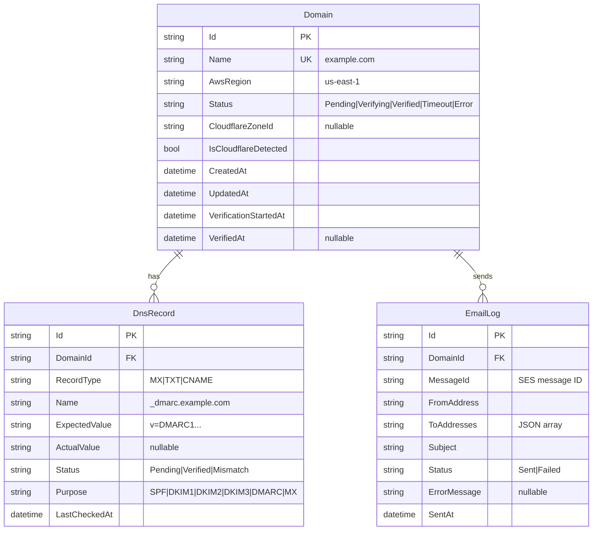

# feat: Selfmx - Self-Hosted Email Sending Platform

## Enhancement Summary

**Deepened on:** 2026-01-21
**Research agents used:** 10 (best-practices-researcher ×3, security-sentinel, performance-oracle, architecture-strategist, kieran-typescript-reviewer, code-simplicity-reviewer, pattern-recognition-specialist, frontend-design)
**Context7 queries:** ASP.NET Core, Hangfire, TanStack Query v5

### Key Improvements
1. **Security hardened** - bcrypt password hashing, environment variables for secrets, rate limiting with sliding window (5 attempts/15 min), constant-time password comparison
2. **Simplified architecture** - Reduced from 4 projects to 2 (single API project, npm package), consolidated state machine (3 states vs 5)
3. **Performance optimized** - SQLite WAL mode, DNS result caching (5 min TTL), connection pooling, TanStack Query with proper staleTime
4. **Production patterns** - Structured logging, health checks, typed configuration, proper DI registration

### Critical Security Findings (Must Address)
1. **Never store plaintext passwords** - Use bcrypt/Argon2 hash in appsettings
2. **AWS credentials via environment** - Never in appsettings.json
3. **SQLite file protection** - Store outside web root, restrict permissions
4. **Input validation** - Prevent email injection via recipient parsing

---

## Overview

Selfmx is a self-hosted email sending platform that provides a Resend-compatible API backed by AWS SES. It automates domain verification with DNS record management, supports automatic Cloudflare DNS integration, and includes a modern React dashboard for managing domains.

**Project:** selfmx
**Site:** selfmx.com
**GitHub:** kieranklaassen/selfmx
**Stack:** .NET 9, ASP.NET Core, Hangfire, SQLite, React, Vite, TypeScript, shadcn/ui

## Problem Statement

Setting up email sending for side projects requires:
1. Creating AWS SES domain identities manually
2. Figuring out the correct DNS records (MX, SPF, DKIM x3, DMARC)
3. Adding records to DNS provider and waiting for propagation
4. Verifying everything is correct
5. Writing integration code with proper error handling

Selfmx automates this entire workflow and provides a drop-in Resend-compatible API, so you can use the familiar Resend SDK but send through your own AWS SES account at a fraction of the cost ($0.10/1000 emails vs $3/1000).

## Technical Approach

### Conventions

**Directory Naming:** All plural (Endpoints/, Services/, Jobs/, Configurations/, Authentications/)
**File Naming:** PascalCase matching class name (DomainService.cs, not domainService.cs)
**Test Naming:** `{ClassName}.Tests.cs` (e.g., `DomainService.Tests.cs`)
**Component Naming:**
- Route pages: `{Name}Page.tsx` (e.g., `DomainDetailPage.tsx`)
- Presentational: `{Name}View.tsx` or `{Name}Card.tsx`

### Research Insights: .NET 9 Best Practices

**Minimal API Patterns (from Context7):**
```csharp
// Use MapGroup for endpoint organization WITH API VERSIONING
var v1 = app.MapGroup("/v1")
    .RequireAuthorization();

var domains = v1.MapGroup("/domains");
domains.MapGet("/", GetDomainsAsync);        // Supports ?page=1&limit=20
domains.MapPost("/", CreateDomainAsync);
domains.MapGet("/{id}", GetDomainAsync);
domains.MapDelete("/{id}", DeleteDomainAsync);

var emails = v1.MapGroup("/emails");
emails.MapPost("/", SendEmailAsync);
```

**Dependency Injection Pattern:**
```csharp
// Register services with appropriate lifetimes
builder.Services.AddScoped<IDomainService, DomainService>();
builder.Services.AddSingleton<IDnsChecker, DnsChecker>();
builder.Services.AddSingleton<IDnsResultCache, DnsResultCache>();
builder.Services.AddHttpClient<ICloudflareClient, CloudflareClient>();
builder.Services.AddHttpClient<ISesService, SesService>();
```

**Authentication Pattern (Security-Hardened):**
```csharp
// Password hash stored in appsettings, verify with constant-time comparison
builder.Services.AddAuthentication("Bearer")
    .AddScheme<AuthenticationSchemeOptions, PasswordBearerHandler>("Bearer", null);

// Rate limiting with sliding window
builder.Services.AddRateLimiter(options =>
{
    options.AddSlidingWindowLimiter("auth", opt =>
    {
        opt.Window = TimeSpan.FromMinutes(15);
        opt.SegmentsPerWindow = 3;
        opt.PermitLimit = 5;
    });
});
```

### Architecture

```
┌─────────────────────────────────────────────────────────────────────────────┐
│                              SELFMX ARCHITECTURE                             │
├─────────────────────────────────────────────────────────────────────────────┤
│                                                                              │
│   ┌─────────────────┐     ┌─────────────────┐     ┌─────────────────┐       │
│   │  React + Vite   │     │   selfmx-client │     │   curl / other  │       │
│   │   Dashboard     │     │   npm package   │     │     clients     │       │
│   └────────┬────────┘     └────────┬────────┘     └────────┬────────┘       │
│            │                       │                       │                │
│            └───────────────────────┼───────────────────────┘                │
│                                    │                                        │
│                                    ▼                                        │
│   ┌─────────────────────────────────────────────────────────────────┐       │
│   │                      ASP.NET Core API                           │       │
│   │  ┌─────────────┐  ┌─────────────┐  ┌─────────────────────────┐ │       │
│   │  │   /emails   │  │  /domains   │  │   /domains/{id}/verify  │ │       │
│   │  │  (Resend-   │  │ Management  │  │   /domains/{id}/cf-add  │ │       │
│   │  │ compatible) │  │    CRUD     │  │   Manual actions        │ │       │
│   │  └─────────────┘  └─────────────┘  └─────────────────────────┘ │       │
│   └─────────────────────────────────────────────────────────────────┘       │
│                  │                    │                                     │
│                  ▼                    ▼                                     │
│   ┌──────────────────────┐  ┌─────────────────────────────┐                 │
│   │       SQLite         │  │        Hangfire             │                 │
│   │  ┌────────────────┐  │  │  ┌───────────────────────┐  │                 │
│   │  │ Domains        │  │  │  │ DnsVerificationJob    │  │                 │
│   │  │ DnsRecords     │  │  │  │ - Fixed 5-min interval│  │                 │
│   │  │ EmailLogs      │  │  │  │ - 24h timeout         │  │                 │
│   │  │ Hangfire tables│  │  │  │ - Single worker       │  │                 │
│   │  └────────────────┘  │  │  └───────────────────────┘  │                 │
│   └──────────────────────┘  └─────────────────────────────┘                 │
│                  │                                                          │
│                  ▼                                                          │
│   ┌─────────────────────────────────────────────────────────────────┐       │
│   │                    External Services                            │       │
│   │  ┌─────────────┐  ┌─────────────┐  ┌─────────────────────────┐ │       │
│   │  │   AWS SES   │  │  Cloudflare │  │   DNS Resolvers         │ │       │
│   │  │  - Create   │  │  - Zone ID  │  │  - Google 8.8.8.8       │ │       │
│   │  │    identity │  │  - Add DNS  │  │  - Cloudflare 1.1.1.1   │ │       │
│   │  │  - Send     │  │    records  │  │  - Quad9 9.9.9.9        │ │       │
│   │  │    email    │  │             │  │                         │ │       │
│   │  └─────────────┘  └─────────────┘  └─────────────────────────┘ │       │
│   └─────────────────────────────────────────────────────────────────┘       │
│                                                                              │
└─────────────────────────────────────────────────────────────────────────────┘
```

### Solution Design

#### 1. Backend (.NET 9 + ASP.NET Core)

> **Simplicity Insight:** Reduced from 4 projects to single API project with embedded tests. Playwright tests in separate project only when needed.

**Project Structure (Simplified):**
```
src/
  Selfmx.Api/                 # Single project - API + Frontend
    Program.cs                # App configuration and DI
    Endpoints/
      EmailEndpoints.cs       # POST /v1/emails (Resend-compatible)
      DomainEndpoints.cs      # Domain management CRUD
      AuthEndpoints.cs        # POST /v1/auth/login
    Services/
      IEmailSender.cs         # Email sending abstraction
      SesEmailSender.cs       # AWS SES v2 implementation
      IDomainService.cs       # Domain management
      DomainService.cs        # Domain business logic (includes IsTimedOut logic)
      IDnsChecker.cs          # DNS verification abstraction
      DnsChecker.cs           # DnsClient.NET implementation
      DnsResultCache.cs       # In-memory cache (5min TTL)
      ICloudflareClient.cs    # Cloudflare API abstraction
      CloudflareClient.cs     # Cloudflare implementation
    Jobs/
      DnsVerificationJob.cs   # Hangfire job (fixed 5-min interval)
    Data/
      SelfmxDbContext.cs      # EF Core DbContext (WAL mode)
      Entities/
        Domain.cs             # Domain entity (anemic - no business logic)
        DnsRecord.cs          # DNS record entity
        EmailLog.cs           # Email sending log
    Settings/
      SelfmxSettings.cs       # Typed configuration (renamed from Configuration/)
    Authentication/
      PasswordBearerHandler.cs   # Custom auth handler
    Contracts/
      Requests/
        SendEmailRequest.cs   # Explicit request DTO
        CreateDomainRequest.cs
      Responses/
        SendEmailResponse.cs  # Explicit response DTO
        DomainResponse.cs
        ApiError.cs           # Standardized error format
    ClientApp/                # Embedded React frontend
      ...

tests/
  Selfmx.Api.Tests/           # Unit + integration tests
    Services/
    Endpoints/
    Jobs/
    TestHelpers/
      FakeSesService.cs       # In-memory fake (not mock)
      FakeDnsChecker.cs       # Controllable DNS responses
      FakeCloudflareClient.cs # Controllable CF responses
```

> **Testing Insight:** Use fakes over mocks for external services - they're easier to reason about and provide realistic behavior.

**Key Configuration (appsettings.json):**

> **Security Critical:** Never store secrets in appsettings.json. Use environment variables or user secrets.

```json
{
  "Selfmx": {
    "PasswordHash": "$2a$12$...",  // bcrypt hash, set via user-secrets in dev
    "AwsRegions": ["us-east-1", "eu-west-1"],
    "DefaultAwsRegion": "us-east-1",
    "DnsCheckIntervalSeconds": 300,  // Fixed 5-min polling (simplified from exponential)
    "VerificationTimeoutHours": 24
  },
  "ConnectionStrings": {
    "DefaultConnection": "Data Source=/var/data/selfmx/selfmx.db"  // Outside web root!
  }
}
```

**Environment Variables (secrets):**
```bash
# Required - never in appsettings.json
export SELFMX__PASSWORDHASH="$2a$12$..."  # bcrypt hash of your password
export SELFMX__CLOUDFLAREAPITOKEN="cf-api-token"
export AWS_ACCESS_KEY_ID="..."
export AWS_SECRET_ACCESS_KEY="..."
export AWS_REGION="us-east-1"
```

**Startup Configuration Pattern:**
```csharp
// Program.cs - Production-ready configuration
var builder = WebApplication.CreateBuilder(args);

// Bind strongly-typed configuration
builder.Services.Configure<SelfmxSettings>(
    builder.Configuration.GetSection("Selfmx"));

// Validate configuration at startup (fail fast)
builder.Services.AddOptions<SelfmxSettings>()
    .ValidateDataAnnotations()
    .ValidateOnStart();

// SQLite with WAL mode for better concurrency
builder.Services.AddDbContext<SelfmxDbContext>(options =>
    options.UseSqlite(connectionString, sqlite =>
        sqlite.CommandTimeout(30)));

// Global exception handler
app.UseExceptionHandler(handler =>
{
    handler.Run(async context =>
    {
        var env = context.RequestServices.GetRequiredService<IHostEnvironment>();
        context.Response.StatusCode = 500;
        await context.Response.WriteAsJsonAsync(new ApiError(
            "internal_error",
            env.IsDevelopment() ? context.Features.Get<IExceptionHandlerFeature>()?.Error.Message : "An unexpected error occurred"
        ));
    });
});

// Graceful shutdown
builder.Services.Configure<HostOptions>(options =>
{
    options.ShutdownTimeout = TimeSpan.FromSeconds(30);
});
```

**Explicit Request/Response DTOs (Resend-compatible):**
```csharp
// Contracts/Requests/SendEmailRequest.cs
public record SendEmailRequest(
    string From,
    string[] To,
    string Subject,
    string? Html,
    string? Text,
    string[]? Cc,
    string[]? Bcc,
    string? ReplyTo,
    Dictionary<string, string>? Headers,
    Attachment[]? Attachments
);

public record Attachment(string Filename, string Content, string? ContentType);

// Contracts/Requests/CreateDomainRequest.cs
public record CreateDomainRequest(string Name, string AwsRegion);

// Contracts/Responses/SendEmailResponse.cs
public record SendEmailResponse(string Id);

// Contracts/Responses/DomainResponse.cs
public record DomainResponse(
    string Id,
    string Name,
    string Status,
    string AwsRegion,
    bool IsCloudflareDetected,
    bool IsTimedOut,  // Computed by service, not entity
    DateTime CreatedAt,
    DateTime? VerifiedAt,
    DnsRecordResponse[] DnsRecords
);

public record DnsRecordResponse(
    string Id,
    string RecordType,
    string Name,
    string ExpectedValue,
    string? ActualValue,
    string Status,
    string Purpose
);

// Contracts/Responses/ApiError.cs - STANDARDIZED (Resend-compatible nested format)
public record ApiError(string Code, string Message)
{
    // Serialize as nested: { "error": { "code": "...", "message": "..." } }
    public object ToResponse() => new { error = new { code = Code, message = Message } };
}

// Contracts/Responses/PaginatedResponse.cs
public record PaginatedResponse<T>(
    T[] Data,
    int Page,
    int Limit,
    int Total
);
```

#### 2. Frontend (React + Vite + shadcn/ui)

### Research Insights: TanStack Query Patterns (from Context7)

**Zod Schema Validation (Runtime Type Safety):**
```typescript
// lib/schemas.ts - Runtime validation for API responses
import { z } from 'zod';

export const DomainStatusSchema = z.enum(['pending', 'verifying', 'verified']);

export const DnsRecordSchema = z.object({
  id: z.string(),
  recordType: z.enum(['MX', 'TXT', 'CNAME']),
  name: z.string(),
  expectedValue: z.string(),
  actualValue: z.string().nullable(),
  status: z.enum(['pending', 'verified', 'mismatch']),
  purpose: z.enum(['SPF', 'DKIM1', 'DKIM2', 'DKIM3', 'DMARC', 'MX']),
});

export const DomainSchema = z.object({
  id: z.string(),
  name: z.string(),
  status: DomainStatusSchema,
  awsRegion: z.string(),
  isCloudflareDetected: z.boolean(),
  isTimedOut: z.boolean(),
  createdAt: z.string().datetime(),
  verifiedAt: z.string().datetime().nullable(),
  dnsRecords: z.array(DnsRecordSchema),
});

export const PaginatedDomainsSchema = z.object({
  data: z.array(DomainSchema),
  page: z.number(),
  limit: z.number(),
  total: z.number(),
});

export type Domain = z.infer<typeof DomainSchema>;
export type DnsRecord = z.infer<typeof DnsRecordSchema>;
```

**Query Key Factory Pattern:**
```typescript
// lib/queries.ts - Centralized query keys for cache management
export const domainKeys = {
  all: ['domains'] as const,
  lists: () => [...domainKeys.all, 'list'] as const,
  list: (filters: string) => [...domainKeys.lists(), { filters }] as const,
  details: () => [...domainKeys.all, 'detail'] as const,
  detail: (id: string) => [...domainKeys.details(), id] as const,
};
```

**Optimistic Updates Pattern (Type-Safe):**
```typescript
// From Context7 TanStack Query v5 docs - WITH TYPE ANNOTATIONS
const addDomainMutation = useMutation({
  mutationFn: (domain: CreateDomainRequest) => api.domains.create(domain),
  onMutate: async (newDomain) => {
    // Cancel outgoing refetches
    await queryClient.cancelQueries({ queryKey: domainKeys.lists() });

    // Snapshot previous value
    const previousDomains = queryClient.getQueryData<Domain[]>(domainKeys.lists());

    // Optimistically update - WITH PROPER TYPE ANNOTATION
    queryClient.setQueryData<Domain[]>(domainKeys.lists(), (old: Domain[] | undefined) => [
      ...(old ?? []),
      {
        ...newDomain,
        id: `temp-${Date.now()}`,
        status: 'pending' as const,
        isTimedOut: false,
        isCloudflareDetected: false,
        createdAt: new Date().toISOString(),
        verifiedAt: null,
        dnsRecords: [],
      },
    ]);

    return { previousDomains };
  },
  onError: (err, newDomain, context) => {
    // Rollback on error
    if (context?.previousDomains) {
      queryClient.setQueryData<Domain[]>(domainKeys.lists(), context.previousDomains);
    }
  },
  onSettled: () => {
    queryClient.invalidateQueries({ queryKey: domainKeys.lists() });
  },
});
```

**API Client with Zod Validation:**
```typescript
// lib/api.ts - Validates responses at runtime
async function fetchDomains(page = 1, limit = 20): Promise<PaginatedDomains> {
  const response = await fetch(`/v1/domains?page=${page}&limit=${limit}`, {
    headers: { Authorization: `Bearer ${getToken()}` },
  });

  if (!response.ok) {
    const error = await response.json();
    throw new ApiError(error.error.code, error.error.message, response.status);
  }

  const data = await response.json();
  return PaginatedDomainsSchema.parse(data); // Runtime validation!
}
```

**Polling Configuration:**
```typescript
// Domain detail page - poll while verifying
const { data: domain } = useQuery({
  queryKey: domainKeys.detail(domainId),
  queryFn: () => api.domains.get(domainId),
  refetchInterval: (query) =>
    query.state.data?.status === 'verifying' ? 30_000 : false,
  staleTime: 5 * 60 * 1000, // 5 minutes
});
```

**Structure:**
```
src/Selfmx.Api/ClientApp/
  src/
    components/
      ui/                     # shadcn/ui components
      domains/
        DomainList.tsx        # Domain listing with status badges
        DomainCard.tsx        # Individual domain card
        DomainDetailView.tsx  # Full domain view (presentational)
        DnsRecordTable.tsx    # DNS record status table (red/green indicators)
        AddDomainDialog.tsx   # Add domain modal with region selector
        CloudflareDialog.tsx  # CF record confirmation
    pages/
      LoginPage.tsx           # Password entry (rate limited)
      DashboardPage.tsx       # Main dashboard
      DomainDetailPage.tsx    # Domain details page (route-level)
    lib/
      api.ts                  # API client with Zod validation
      schemas.ts              # Zod schemas for runtime validation
      queries.ts              # TanStack Query key factory + hooks
      types.ts                # TypeScript types (inferred from Zod)
    App.tsx
    main.tsx
  vite.config.ts
  tailwind.config.js
  package.json                # Includes: zod, @tanstack/react-query
```

### Research Insights: Frontend Design Patterns

**DNS Status Indicators (shadcn/ui):**
```tsx
// DnsRecordStatus.tsx - Clear visual hierarchy
const statusConfig = {
  pending: { icon: Clock, color: 'text-muted-foreground', bg: 'bg-muted' },
  verifying: { icon: Loader2, color: 'text-yellow-600', bg: 'bg-yellow-50', animate: true },
  verified: { icon: CheckCircle2, color: 'text-green-600', bg: 'bg-green-50' },
  mismatch: { icon: XCircle, color: 'text-red-600', bg: 'bg-red-50' },
};

function DnsRecordRow({ record }: { record: DnsRecord }) {
  const config = statusConfig[record.status];
  const Icon = config.icon;

  return (
    <TableRow className={config.bg}>
      <TableCell className="font-mono text-sm">{record.name}</TableCell>
      <TableCell>
        <Badge variant="outline">{record.recordType}</Badge>
      </TableCell>
      <TableCell className="font-mono text-xs max-w-xs truncate">
        {record.expectedValue}
        <CopyButton value={record.expectedValue} />
      </TableCell>
      <TableCell>
        <Icon className={cn(config.color, config.animate && 'animate-spin')} />
      </TableCell>
    </TableRow>
  );
}
```

#### 3. NPM Package (selfmx-client)

### Research Insights: TypeScript SDK Patterns

**Branded Types for Type Safety:**
```typescript
// types.ts - Prevent mixing up string IDs
declare const __brand: unique symbol;
type Brand<B> = { [__brand]: B };
type Branded<T, B> = T & Brand<B>;

export type EmailId = Branded<string, 'EmailId'>;
export type DomainId = Branded<string, 'DomainId'>;
```

**Error Classes with Cause Chain (using `as const` for type narrowing):**
```typescript
// errors.ts - Rich error context with proper type narrowing
export class SelfmxError extends Error {
  override readonly name = 'SelfmxError' as const;

  constructor(
    message: string,
    public readonly code: string,
    public readonly statusCode: number,
    public readonly cause?: Error
  ) {
    super(message);
  }
}

export class ValidationError extends SelfmxError {
  override readonly name = 'ValidationError' as const;

  constructor(message: string, public readonly field?: string) {
    super(message, 'validation_error', 422);
  }
}

export class AuthenticationError extends SelfmxError {
  override readonly name = 'AuthenticationError' as const;

  constructor() {
    super('Invalid API key', 'authentication_error', 401);
  }
}

export class RateLimitError extends SelfmxError {
  override readonly name = 'RateLimitError' as const;

  constructor(public readonly retryAfter?: number) {
    super('Rate limit exceeded', 'rate_limit_error', 429);
  }
}

// Type-safe error handling in catch blocks:
// if (error instanceof RateLimitError) { error.retryAfter } // TypeScript knows the type
```

**Structure:**
```
packages/selfmx-client/
  src/
    index.ts                  # Main exports
    client.ts                 # SelfmxClient class
    types.ts                  # TypeScript interfaces + branded types
    errors.ts                 # Custom error classes with cause chain
  package.json
  tsconfig.json
  tsup.config.ts              # Dual ESM/CJS build
  README.md
```

**Usage (Resend-compatible):**
```typescript
import { Selfmx, SelfmxError, RateLimitError } from 'selfmx-client';

// Drop-in replacement for Resend
const selfmx = new Selfmx({
  apiKey: 'your-password',
  baseUrl: 'https://your-selfmx-instance.com'  // Only difference from Resend
});

try {
  const { id } = await selfmx.emails.send({
    from: 'hello@yourdomain.com',
    to: 'user@example.com',
    subject: 'Hello World',
    html: '<p>Welcome!</p>'
  });
  console.log(`Sent email: ${id}`);
} catch (error) {
  if (error instanceof RateLimitError) {
    // Wait and retry
    await sleep(error.retryAfter ?? 60_000);
  } else if (error instanceof SelfmxError) {
    console.error(`API error: ${error.code} - ${error.message}`);
  }
  throw error;
}
```

### Data Model



### Domain States

> **Simplicity Insight:** Reduced from 5 states to 3. Timeout is handled by checking `VerificationStartedAt + 24h` rather than a separate state.

```
                    ┌─────────┐
                    │ PENDING │ (just created, SES identity being created)
                    └────┬────┘
                         │ SES identity created successfully
                         ▼
                  ┌──────────────┐
                  │  VERIFYING   │ ◄───────────────┐
                  └──────┬───────┘                 │
                         │                         │
              ┌──────────┴──────────┐              │
              │                     │              │ User clicks
              ▼                     ▼              │ "Restart"
        ┌───────────┐        ┌───────────┐        │
        │ All DNS   │        │ 24h check │        │
        │ verified  │        │ (timeout) │────────┘
        └─────┬─────┘        └───────────┘
              │
              ▼
        ┌──────────┐
        │ VERIFIED │
        └──────────┘
```

**State Implementation:**
```csharp
// Data/Entities/Domain.cs - ANEMIC entity (no business logic)
public class Domain
{
    public string Id { get; set; } = Guid.NewGuid().ToString();
    public string Name { get; set; } = string.Empty;
    public DomainStatus Status { get; set; } = DomainStatus.Pending;
    public string AwsRegion { get; set; } = string.Empty;
    public string? CloudflareZoneId { get; set; }
    public bool IsCloudflareDetected { get; set; }
    public DateTime CreatedAt { get; set; } = DateTime.UtcNow;
    public DateTime? VerificationStartedAt { get; set; }
    public DateTime? VerifiedAt { get; set; }

    public ICollection<DnsRecord> DnsRecords { get; set; } = new List<DnsRecord>();
    public ICollection<EmailLog> EmailLogs { get; set; } = new List<EmailLog>();
}

public enum DomainStatus
{
    Pending,    // SES identity being created
    Verifying,  // DNS records being checked
    Verified    // All records confirmed
}

// Services/DomainService.cs - Business logic lives HERE, not in entity
public class DomainService : IDomainService
{
    private readonly SelfmxSettings _settings;

    // IsTimedOut is BUSINESS LOGIC - belongs in service, not entity
    public bool IsTimedOut(Domain domain) =>
        domain.Status == DomainStatus.Verifying
        && domain.VerificationStartedAt.HasValue
        && DateTime.UtcNow - domain.VerificationStartedAt.Value > _settings.VerificationTimeout;

    // Map entity to response DTO (includes computed IsTimedOut)
    public DomainResponse ToResponse(Domain domain) => new(
        domain.Id,
        domain.Name,
        domain.Status.ToString().ToLowerInvariant(),
        domain.AwsRegion,
        domain.IsCloudflareDetected,
        IsTimedOut(domain),  // Computed here
        domain.CreatedAt,
        domain.VerifiedAt,
        domain.DnsRecords.Select(r => ToResponse(r)).ToArray()
    );
}
```

## Implementation Phases

### Phase 1: Project Foundation

**Goal:** Basic project structure, database, and authentication

### Research Insights: Hangfire with SQLite (from Context7)

```csharp
// Program.cs - Hangfire configuration
builder.Services.AddHangfire(config => config
    .SetDataCompatibilityLevel(CompatibilityLevel.Version_180)
    .UseSimpleAssemblyNameTypeSerializer()
    .UseRecommendedSerializerSettings()
    .UseSQLiteStorage(connectionString));

// Single worker for SQLite (concurrent writes cause locks)
builder.Services.AddHangfireServer(options =>
{
    options.WorkerCount = 1;
    options.Queues = new[] { "default" };
});

// Recurring job for DNS verification (from Context7 docs)
RecurringJob.AddOrUpdate<DnsVerificationJob>(
    "dns-verification",
    job => job.ExecuteAsync(CancellationToken.None),
    "*/5 * * * *",  // Every 5 minutes (simplified from exponential backoff)
    new RecurringJobOptions { TimeZone = TimeZoneInfo.Utc }
);
```

- [ ] **1.1 Initialize .NET 9 solution**
  - Create solution file `Selfmx.sln`
  - Create `Selfmx.Api` project (single project, not separate class libraries)
  - Create `Selfmx.Api.Tests` project
  - Add `Directory.Build.props` for centralized build settings
  - Add `Directory.Packages.props` for central package management
  - Add `.editorconfig` for code style
  - Add `global.json` to pin SDK version (.NET 9)

- [ ] **1.2 Configure SQLite with EF Core**
  - Install packages: `Microsoft.EntityFrameworkCore.Sqlite`
  - Create `SelfmxDbContext.cs` with entity configurations
  - Create `Domain`, `DnsRecord`, `EmailLog` entities (anemic - no business logic)
  - Add initial migration
  - **Configure WAL mode** for better concurrency:
    ```csharp
    protected override void OnConfiguring(DbContextOptionsBuilder options)
    {
        options.UseSqlite(connectionString, sqlite =>
        {
            // After connection, enable WAL mode
        });
    }

    // In migration or startup:
    // PRAGMA journal_mode=WAL;
    // PRAGMA synchronous=NORMAL;
    // PRAGMA cache_size=-64000; // 64MB cache
    ```
  - **Database Migration Strategy** (auto-migrate on startup for single-instance):
    ```csharp
    // Program.cs - Auto-migrate on startup
    // Acceptable for single-instance self-hosted deployment
    using var scope = app.Services.CreateScope();
    var db = scope.ServiceProvider.GetRequiredService<SelfmxDbContext>();
    await db.Database.MigrateAsync();

    // For upgrades: add new migrations with `dotnet ef migrations add <Name>`
    // Migrations run automatically on next startup
    ```

- [ ] **1.3 Implement password authentication (Security-Hardened)**
  - Create `SelfmxSettings.cs` for typed configuration with validation
  - **Store bcrypt hash**, not plaintext password
  - Use `CryptographicOperations.FixedTimeEquals` for timing-attack resistance:
    ```csharp
    public static bool VerifyPassword(string input, string storedHash)
    {
        return BCrypt.Net.BCrypt.Verify(input, storedHash);
    }
    ```
  - Implement Bearer token auth for API
  - Implement session cookie auth for web UI (HttpOnly, Secure, SameSite=Strict)
  - **Rate limiting** with sliding window (5 attempts/15 min)
  - **Health check endpoint** (`/health`) - unauthenticated:
    ```csharp
    // Program.cs
    builder.Services.AddHealthChecks()
        .AddSqlite(connectionString, name: "database")
        .AddCheck("hangfire", () =>
        {
            // Check if Hangfire is processing jobs
            return HealthCheckResult.Healthy();
        });

    app.MapHealthChecks("/health", new HealthCheckOptions
    {
        ResponseWriter = UIResponseWriter.WriteHealthCheckUIResponse
    });
    ```
  - **Structured logging for auth failures**:
    ```csharp
    _logger.LogWarning(
        "Authentication failed for IP {IpAddress} - attempt {Attempt} of {MaxAttempts}",
        context.Connection.RemoteIpAddress,
        attemptCount,
        maxAttempts);
    ```

- [ ] **1.4 Setup React + Vite frontend**
  - Initialize Vite project in `ClientApp/`
  - Install and configure Tailwind CSS
  - Install and configure shadcn/ui
  - Configure Vite proxy for development
  - Create login page with password form

**Tests for Phase 1:**
- [ ] Unit test: Password validation
- [ ] Unit test: Rate limiting logic
- [ ] Integration test: SQLite context initialization
- [ ] E2E test: Login flow (valid/invalid password)

### Phase 2: AWS SES Integration

**Goal:** Create domain identities and retrieve DNS records from SES

### Research Insights: AWS SES v2 SDK Patterns

```csharp
// SesService.cs - AWS SES v2 implementation
public class SesService : ISesService
{
    private readonly IAmazonSimpleEmailServiceV2 _sesClient;

    public async Task<CreateIdentityResult> CreateDomainIdentityAsync(
        string domain,
        string region,
        CancellationToken ct = default)
    {
        // Use v2 SDK for modern features
        var request = new CreateEmailIdentityRequest
        {
            EmailIdentity = domain,
            DkimSigningAttributes = new DkimSigningAttributes
            {
                DomainSigningSelector = "ses",
                NextSigningKeyLength = "RSA_2048_BIT"
            }
        };

        try
        {
            var response = await _sesClient.CreateEmailIdentityAsync(request, ct);
            return new CreateIdentityResult
            {
                DkimTokens = response.DkimAttributes?.Tokens ?? new List<string>(),
                VerificationStatus = response.VerifiedForSendingStatus
            };
        }
        catch (AlreadyExistsException)
        {
            // Domain already exists - get existing DKIM attributes
            return await GetExistingIdentityAsync(domain, ct);
        }
    }

    public async Task<SendEmailResult> SendEmailAsync(
        SendEmailRequest email,
        CancellationToken ct = default)
    {
        var request = new Amazon.SimpleEmailV2.Model.SendEmailRequest
        {
            FromEmailAddress = email.From,
            Destination = new Destination
            {
                ToAddresses = email.To.ToList(),
                CcAddresses = email.Cc?.ToList() ?? new List<string>(),
                BccAddresses = email.Bcc?.ToList() ?? new List<string>()
            },
            Content = new EmailContent
            {
                Simple = new Message
                {
                    Subject = new Content { Data = email.Subject },
                    Body = new Body
                    {
                        Html = email.Html != null ? new Content { Data = email.Html } : null,
                        Text = email.Text != null ? new Content { Data = email.Text } : null
                    }
                }
            }
        };

        var response = await _sesClient.SendEmailAsync(request, ct);
        return new SendEmailResult { MessageId = response.MessageId };
    }
}
```

**Error Mapping to Resend-Compatible Responses (using standardized ApiError):**
```csharp
// Use ApiError.ToResponse() for consistent nested format: { "error": { "code": "...", "message": "..." } }
catch (MessageRejectedException ex) =>
    Results.Json(new ApiError("validation_error", ex.Message).ToResponse(), statusCode: 422);

catch (MailFromDomainNotVerifiedException) =>
    Results.Json(new ApiError("forbidden", "Domain not verified").ToResponse(), statusCode: 403);

catch (TooManyRequestsException)
{
    // IMPORTANT: Set Retry-After header for rate limit responses
    context.Response.Headers["Retry-After"] = "60";
    return Results.Json(new ApiError("rate_limit", "Rate limit exceeded").ToResponse(), statusCode: 429);
}

catch (AccountSuspendedException) =>
    Results.Json(new ApiError("forbidden", "SES account suspended").ToResponse(), statusCode: 403);
```

- [ ] **2.1 Setup AWS SES service**
  - Install `AWSSDK.SimpleEmailV2` (v2 SDK, not v1)
  - Create `ISesService` interface
  - Implement `SesService` with:
    - `CreateDomainIdentityAsync(domain, region)`
    - `GetDkimAttributesAsync(domain)`
    - `DeleteDomainIdentityAsync(domain)`
    - `SendEmailAsync(email)`
  - **AWS credentials via environment** (never in appsettings)
  - Handle SES-specific errors with Resend-compatible responses

- [ ] **2.2 Create domain addition flow**
  - Create `IDomainService` interface
  - Implement `DomainService.AddDomainAsync()`:
    1. Validate domain format
    2. Check if exists locally
    3. Create SES identity (selected region)
    4. Retrieve DKIM tokens
    5. Generate all required DNS records
    6. Save to database
  - Create `POST /api/domains` endpoint
  - Create `GET /api/domains` endpoint
  - Create `GET /api/domains/{id}` endpoint
  - Create `DELETE /api/domains/{id}` endpoint

- [ ] **2.3 Generate DNS record requirements**
  - MX record: `10 feedback-smtp.{region}.amazonses.com`
  - SPF record: `v=spf1 include:amazonses.com ~all`
  - DKIM records (x3): `{token}._domainkey.{domain}` → `{token}.dkim.amazonses.com`
  - DMARC record: `v=DMARC1; p=quarantine; rua=mailto:dmarc@{domain}`
  - Store expected values in database

- [ ] **2.4 Frontend: Domain management UI**
  - Create `DomainList` component with status badges
  - Create `AddDomainDialog` with domain input + region selector
  - Create `DomainDetail` page showing all DNS records
  - Display expected values with copy buttons
  - Show verification status per record

**Tests for Phase 2:**
- [ ] Unit test: Domain validation
- [ ] Unit test: DNS record generation
- [ ] Integration test: SES mock - create identity
- [ ] Integration test: SES mock - already exists error
- [ ] E2E test: Add domain flow

### Phase 3: DNS Verification System

**Goal:** Background job that polls DNS and updates verification status

### Research Insights: Performance Optimization

**DNS Result Caching (5-min TTL):**
```csharp
// DnsResultCache.cs - Avoid hammering DNS resolvers
public class DnsResultCache : IDnsResultCache
{
    private readonly IMemoryCache _cache;
    private readonly TimeSpan _ttl = TimeSpan.FromMinutes(5);

    public async Task<DnsCheckResult?> GetOrAddAsync(
        string recordName,
        string recordType,
        Func<Task<DnsCheckResult>> factory)
    {
        var key = $"dns:{recordType}:{recordName}";
        return await _cache.GetOrCreateAsync(key, async entry =>
        {
            entry.AbsoluteExpirationRelativeToNow = _ttl;
            return await factory();
        });
    }
}
```

**Simplified Polling (Performance Insight):**
> Instead of exponential backoff (complex state tracking), use fixed 5-minute polling with 24h timeout. Simpler, predictable, and DNS propagation is the bottleneck anyway.

- [ ] **3.1 Setup Hangfire**
  - Install `Hangfire.Core`, `Hangfire.AspNetCore`, `Hangfire.Storage.SQLite`
  - Configure SQLite storage
  - **Set worker count to 1** (SQLite limitation - concurrent writes cause locks)
  - Add Hangfire dashboard at `/hangfire` (protected by same password)
  - Configure job serialization for .NET 9 compatibility

- [ ] **3.2 Implement DNS checking service**
  - Install `DnsClient` package
  - Create `IDnsChecker` interface
  - Implement `DnsChecker` with:
    - Multiple DNS resolvers with **fallback logic**:
      ```csharp
      // DnsChecker.cs - Fallback pattern
      private static readonly string[] Resolvers = { "1.1.1.1", "8.8.8.8", "9.9.9.9" };

      public async Task<DnsCheckResult> CheckRecordAsync(
          string name, string type, string expected, CancellationToken ct)
      {
          foreach (var resolver in Resolvers)
          {
              try
              {
                  var client = new LookupClient(IPAddress.Parse(resolver));
                  var result = await client.QueryAsync(name, QueryType.Parse(type), ct);

                  return new DnsCheckResult
                  {
                      Found = result.Answers.Any(),
                      ActualValue = NormalizeValue(result.Answers.FirstOrDefault()?.ToString()),
                      Matches = NormalizeValue(result.Answers.FirstOrDefault()?.ToString()) ==
                                NormalizeValue(expected)
                  };
              }
              catch (DnsResponseException)
              {
                  continue; // Try next resolver
              }
          }

          throw new DnsCheckException("All DNS resolvers failed");
      }
      ```
    - `CheckTxtRecordAsync(name, expectedValue)`
    - `CheckCnameRecordAsync(name, expectedTarget)`
    - `CheckMxRecordAsync(domain, expectedExchange)`
  - **Normalize values** for comparison:
    ```csharp
    private static string NormalizeValue(string? value) =>
        value?.Trim().TrimEnd('.').ToLowerInvariant() ?? "";
    ```
  - **Cache results** for 5 minutes to avoid DNS resolver rate limits

- [ ] **3.3 Create verification job (Simplified)**
  - Implement `DnsVerificationJob` as Hangfire recurring job:
    ```csharp
    public async Task ExecuteAsync(CancellationToken ct)
    {
        var pendingDomains = await _db.Domains
            .Where(d => d.Status == DomainStatus.Verifying)
            .Where(d => !d.IsTimedOut)  // Computed property
            .ToListAsync(ct);

        foreach (var domain in pendingDomains)
        {
            await CheckDomainDnsAsync(domain, ct);
        }
    }
    ```
  - **Fixed 5-minute polling** (not exponential backoff - simpler)
  - 24-hour timeout from verification start
  - Single job processes all pending domains (batch efficiency)

- [ ] **3.4 Job lifecycle management**
  - Start job when domain is added
  - Cancel job when domain is deleted
  - Implement "Restart Verification" action
  - Handle job failures with automatic retry

- [ ] **3.5 Frontend: Real-time status updates**
  - Poll status every 30 seconds on domain detail page
  - Show visual indicators:
    - Gray: Pending (not yet checked)
    - Yellow: Checking (in progress)
    - Red: Mismatch (show expected vs actual)
    - Green: Verified
  - Show time remaining until timeout
  - Show "Restart Verification" button for timeout domains

**Tests for Phase 3:**
- [ ] Unit test: IsTimedOut logic in DomainService
- [ ] Unit test: DNS value normalization
- [ ] Integration test: DNS mock - all records verified
- [ ] Integration test: DNS mock - partial verification
- [ ] Integration test: DNS mock - 24h timeout
- [ ] Integration test: Job cancellation on domain delete
- [ ] E2E test: Verification flow (mocked DNS)

### Phase 4: Cloudflare Integration

**Goal:** Auto-detect Cloudflare domains and add DNS records

- [ ] **4.1 Implement Cloudflare detection**
  - Query NS records for domain
  - Check if nameservers match Cloudflare patterns (`*.ns.cloudflare.com`)
  - Store detection result and zone ID in domain record

- [ ] **4.2 Implement Cloudflare API client**
  - Create `ICloudflareClient` interface
  - Implement `CloudflareClient`:
    - `GetZoneIdAsync(domain)` - find zone by domain name
    - `ListDnsRecordsAsync(zoneId, type?, name?)`
    - `CreateDnsRecordAsync(zoneId, record)`
    - `UpdateDnsRecordAsync(zoneId, recordId, record)`
    - `DeleteDnsRecordAsync(zoneId, recordId)`
  - Handle rate limiting (1200 requests/5 min)
  - Handle auth errors with clear messages

- [ ] **4.3 Create "Add to Cloudflare" endpoint**
  - `POST /api/domains/{id}/cloudflare-records`
  - Check for existing records
  - Return preview of what will be added/updated
  - Require confirmation flag in request
  - Add all records in sequence
  - Handle partial failures gracefully
  - Return per-record success/failure

- [ ] **4.4 Frontend: Cloudflare integration UI**
  - Show "Add to Cloudflare" button only when CF detected
  - Create confirmation dialog showing:
    - Records to be added
    - Records that will be updated (if exist)
    - Warning about overwriting existing records
  - Show progress during addition
  - Show per-record results after completion

**Tests for Phase 4:**
- [ ] Unit test: Cloudflare NS detection
- [ ] Integration test: CF mock - zone ID lookup
- [ ] Integration test: CF mock - create records
- [ ] Integration test: CF mock - partial failure
- [ ] Integration test: CF mock - auth error
- [ ] E2E test: Add to Cloudflare flow

### Phase 5: Email Sending API

**Goal:** Resend-compatible POST /emails endpoint

### Research Insights: Security Hardening for Email API

**Input Validation (Prevent Email Injection):**
```csharp
// EmailValidator.cs - Security-critical validation
public class EmailValidator
{
    private static readonly Regex EmailRegex = new(
        @"^[^@\s]+@[^@\s]+\.[^@\s]+$",
        RegexOptions.Compiled);

    public static ValidationResult ValidateEmailAddress(string email)
    {
        // Check for injection attempts
        if (email.Contains('\r') || email.Contains('\n'))
            return ValidationResult.Error("Invalid email: contains newline characters");

        // Check for header injection in display name
        if (email.Contains(':') && email.IndexOf('<') > email.IndexOf(':'))
            return ValidationResult.Error("Invalid email: possible header injection");

        if (!EmailRegex.IsMatch(email))
            return ValidationResult.Error("Invalid email format");

        return ValidationResult.Success;
    }

    public static string ExtractDomain(string fromAddress)
    {
        // Handle "Name <email@domain.com>" format
        var match = Regex.Match(fromAddress, @"<([^>]+)>");
        var email = match.Success ? match.Groups[1].Value : fromAddress;

        var parts = email.Split('@');
        if (parts.Length != 2)
            throw new ValidationException("Invalid from address format");

        return parts[1].ToLowerInvariant();
    }
}
```

**Rate Limiting per Domain:**
```csharp
// Per-domain rate limiting in addition to global auth rate limiting
builder.Services.AddRateLimiter(options =>
{
    options.AddPolicy("email-send", context =>
    {
        var domain = context.Request.Headers["X-Domain-Id"].ToString();
        return RateLimitPartition.GetSlidingWindowLimiter(
            domain,
            _ => new SlidingWindowRateLimiterOptions
            {
                Window = TimeSpan.FromMinutes(1),
                SegmentsPerWindow = 4,
                PermitLimit = 100  // 100 emails/min per domain
            });
    });
});
```

- [ ] **5.1 Implement Resend-compatible endpoint**
  - `POST /api/emails` with Resend request format
  - **Validate all inputs** (prevent header injection):
    - Check for newline characters in email addresses
    - Validate email format with strict regex
    - Limit subject length (< 998 chars per RFC 2822)
  - Extract sender domain from "from" field (handle `Name <email>` format)
  - Verify domain exists and is verified
  - Return Resend-compatible response: `{ "id": "msg_xxx" }`
  - Return Resend-compatible error: `{ "error": { "code": "xxx", "message": "..." } }`

- [ ] **5.2 Implement SES email sending**
  - Create `IEmailSender` interface
  - Implement `SesEmailSender`:
    - Map Resend request to SES v2 format
    - Handle attachments (base64 decode, validate MIME types)
    - Handle custom headers (whitelist allowed headers)
    - Handle reply-to, cc, bcc
  - **Rate limiting**: 100 emails/min per domain
  - Log all sent emails to `EmailLog` table (but NOT email content - just metadata)

- [ ] **5.3 Error handling and mapping**
  - Map SES errors to Resend-compatible errors:
    - `MessageRejected` → 422 validation_error
    - `MailFromDomainNotVerified` → 403 forbidden
    - `Throttling` → 429 rate_limit
    - `AccountSendingPaused` → 403 forbidden
  - Handle sandbox mode: check if recipient is verified, return helpful error
  - **Never expose internal error details** in production

- [ ] **5.4 Idempotency support**
  > **Simplicity Note:** Defer to post-MVP. Most email sends don't need idempotency, and users can implement client-side deduplication.

**Tests for Phase 5:**
- [ ] Unit test: Request validation
- [ ] Unit test: Domain extraction from "from" field
- [ ] Unit test: Error mapping
- [ ] Integration test: SES mock - successful send
- [ ] Integration test: SES mock - domain not verified
- [ ] Integration test: SES mock - rate limited
- [ ] Integration test: Idempotency key handling
- [ ] E2E test: Send email flow

### Phase 6: TypeScript Client Library

**Goal:** npm package compatible with Resend SDK interface

- [ ] **6.1 Setup package structure**
  - Create `packages/selfmx-client/` directory
  - Initialize `package.json` with dual ESM/CJS support
  - Configure TypeScript with `tsconfig.json`
  - Configure build with `tsup.config.ts`
  - Setup Vitest for testing

- [ ] **6.2 Implement client**
  - Create `Selfmx` class with Resend-compatible interface
  - Create `emails` resource with `send()` method
  - Support all Resend request fields:
    - from, to, subject, html, text
    - cc, bcc, reply_to
    - headers, attachments, tags
  - Support configuration:
    - `apiKey` (required)
    - `baseUrl` (default: could be selfmx.com cloud or self-hosted)

- [ ] **6.3 Error handling**
  - Create typed error classes:
    - `SelfmxError` (base)
    - `ValidationError`
    - `AuthenticationError`
    - `RateLimitError`
  - Include error details from API response

- [ ] **6.4 Documentation**
  - Write README.md with:
    - Installation instructions
    - Quick start example
    - API reference
    - Migration guide from Resend
  - Add JSDoc comments for IntelliSense

- [ ] **6.5 Publish to npm**
  - Configure `publishConfig`
  - Add prepublish build step
  - Publish as `selfmx-client` or `@selfmx/client`

**Tests for Phase 6:**
- [ ] Unit test: Client initialization
- [ ] Unit test: Request formatting
- [ ] Unit test: Error parsing
- [ ] Integration test: Mock server - send email
- [ ] Integration test: Mock server - error responses

### Phase 7: Testing & Polish

**Goal:** Comprehensive test coverage and production readiness

### Research Insights: Security Checklist (from Security Review)

**Critical Security Items:**
1. ✅ Password hashing with bcrypt (Phase 1.3)
2. ✅ AWS credentials via environment variables (Phase 2.1)
3. ✅ Input validation for email injection (Phase 5.1)
4. ✅ Rate limiting (auth + email sending) (Phase 1.3, 5.2)
5. 🔲 SQLite file protection (this phase)
6. 🔲 Security headers (this phase)
7. 🔲 CORS configuration (this phase)

- [ ] **7.1 Test Coverage and Quality Gates**
  - **Coverage targets:**
    - Unit test coverage: > 80% for Services/
    - Integration test coverage: All endpoints
    - E2E coverage: Critical user flows (login, add domain, verify status)
  - **Contract tests** for Resend API compatibility:
    ```csharp
    [Fact]
    public async Task SendEmail_MatchesResendApiContract()
    {
        // Arrange - Resend's documented request format
        var request = new { from = "test@domain.com", to = new[] { "user@example.com" },
                           subject = "Test", html = "<p>Hello</p>" };

        // Act
        var response = await _client.PostAsJsonAsync("/v1/emails", request);

        // Assert - Resend's documented response format
        response.StatusCode.Should().Be(HttpStatusCode.OK);
        var body = await response.Content.ReadFromJsonAsync<JsonElement>();
        body.GetProperty("id").GetString().Should().NotBeNullOrEmpty();
    }
    ```

- [ ] **7.2 Playwright E2E test suite**
  - Setup Playwright for .NET
  - Create page objects:
    - `LoginPage`
    - `DashboardPage`
    - `DomainDetailPage`
  - Write test scenarios:
    - Full domain verification flow (with mocked DNS)
    - Cloudflare integration flow (with mocked CF API)
    - Error handling flows
  - **Accessibility testing:**
    ```csharp
    [Fact]
    public async Task DomainList_IsAccessible()
    {
        await Page.GotoAsync("/dashboard");

        // Keyboard navigation
        await Page.Keyboard.PressAsync("Tab");
        var focused = await Page.EvaluateAsync<string>("document.activeElement.tagName");
        focused.Should().NotBeNullOrEmpty();

        // axe-core accessibility audit
        var violations = await Page.EvaluateAsync<int>(
            "() => axe.run().then(r => r.violations.length)");
        violations.Should().Be(0);
    }
    ```

- [ ] **7.3 Load testing**
  - Test concurrent email sends (100 concurrent requests)
  - Test verification job with 50+ pending domains
  - **Verify SQLite handles the load** with WAL mode
  - Monitor memory usage with Hangfire

- [ ] **7.4 Security hardening (Comprehensive)**
  ```csharp
  // Program.cs - Security configuration
  var app = builder.Build();

  // HTTPS enforcement
  app.UseHttpsRedirection();
  app.UseHsts();

  // Security headers
  app.Use(async (context, next) =>
  {
      var headers = context.Response.Headers;
      headers["X-Content-Type-Options"] = "nosniff";
      headers["X-Frame-Options"] = "DENY";
      headers["X-XSS-Protection"] = "1; mode=block";
      headers["Referrer-Policy"] = "strict-origin-when-cross-origin";
      headers["Content-Security-Policy"] =
          "default-src 'self'; script-src 'self'; style-src 'self' 'unsafe-inline'";
      headers["Permissions-Policy"] =
          "accelerometer=(), camera=(), geolocation=(), microphone=()";
      await next();
  });

  // CORS - restrict to your domains only
  app.UseCors(policy => policy
      .WithOrigins("https://yourdomain.com")
      .AllowCredentials()
      .AllowAnyMethod()
      .AllowAnyHeader());
  ```

  **SQLite File Protection:**
  ```bash
  # Store database outside web root
  /var/data/selfmx/selfmx.db
  /var/data/selfmx/selfmx.db-wal
  /var/data/selfmx/selfmx.db-shm

  # Restrict permissions
  chmod 600 /var/data/selfmx/selfmx.db*
  chown selfmx:selfmx /var/data/selfmx/
  ```

  **Additional security measures:**
  - [ ] Enable HSTS with preload
  - [ ] Configure CSP header
  - [ ] Disable server version headers
  - [ ] Audit logging for auth failures
  - [ ] Dependency vulnerability scanning (`dotnet list package --vulnerable`)

- [ ] **7.5 Documentation**
  - Create deployment guide (Docker, bare metal, Azure App Service)
  - Create API documentation (OpenAPI/Swagger)
  - Create troubleshooting guide
  - Document security configuration requirements

- [ ] **7.6 Docker support**
  ```dockerfile
  # Dockerfile - Multi-stage build
  FROM mcr.microsoft.com/dotnet/sdk:9.0 AS build
  WORKDIR /src
  COPY . .
  RUN dotnet publish -c Release -o /app

  FROM mcr.microsoft.com/dotnet/aspnet:9.0 AS runtime
  WORKDIR /app
  COPY --from=build /app .

  # Create non-root user
  RUN adduser --disabled-password --gecos '' selfmx
  USER selfmx

  # Data volume for SQLite
  VOLUME /var/data/selfmx

  EXPOSE 8080
  ENTRYPOINT ["dotnet", "Selfmx.Api.dll"]
  ```

  ```yaml
  # docker-compose.yml
  version: '3.8'
  services:
    selfmx:
      build: .
      ports:
        - "8080:8080"
      environment:
        - ASPNETCORE_ENVIRONMENT=Production
        - SELFMX__PASSWORDHASH=${SELFMX_PASSWORD_HASH}
        - SELFMX__CLOUDFLAREAPITOKEN=${CF_API_TOKEN}
        - AWS_ACCESS_KEY_ID=${AWS_ACCESS_KEY_ID}
        - AWS_SECRET_ACCESS_KEY=${AWS_SECRET_ACCESS_KEY}
      volumes:
        - selfmx-data:/var/data/selfmx
      restart: unless-stopped

  volumes:
    selfmx-data:
  ```

## Acceptance Criteria

### Functional Requirements

- [ ] User can add a domain and see required DNS records
- [ ] System automatically detects Cloudflare-hosted domains
- [ ] User can click "Add to Cloudflare" to auto-create DNS records
- [ ] DNS verification runs automatically every 5 minutes (fixed interval polling)
- [ ] DNS verification times out after 24 hours
- [ ] User can restart verification on timeout domains
- [ ] DNS status shows red/green per record with expected vs actual values
- [ ] POST /emails endpoint accepts Resend-compatible requests
- [ ] Email sending requires verified domain
- [ ] selfmx-client npm package works as Resend drop-in replacement

### Non-Functional Requirements

- [ ] Authentication via appsettings password (no user system)
- [ ] All external API calls have proper error handling
- [ ] All endpoints have request validation
- [ ] Unit tests for all business logic
- [ ] Integration tests with mocked external services
- [ ] Playwright E2E tests for critical flows
- [ ] Every code file has header comment describing purpose
- [ ] Code has comments explaining non-obvious logic

### Quality Gates

- [ ] All tests pass
- [ ] No security vulnerabilities in dependencies
- [ ] API follows Resend specification exactly
- [ ] Frontend is responsive on mobile
- [ ] Error messages are user-friendly

## Technical Decisions

### Research Insights: Architecture Review Summary

The architecture was approved with modifications. Key decisions validated:
- Single-project structure appropriate for self-hosted tool
- SQLite with WAL mode handles expected load
- Hangfire suitable for background job requirements
- Resend API compatibility enables easy migration

### Why SQLite?
- Perfect for single-instance self-hosting
- Zero configuration required
- File-based backup is trivial
- Sufficient for expected load (< 1000 emails/day)
- **WAL mode** provides good read concurrency
- **Single Hangfire worker** avoids write contention

### Why Hangfire?
- Mature, well-documented job scheduler
- Persistent jobs survive app restarts
- Built-in retry and failure handling
- Dashboard for monitoring at `/hangfire`
- **Recurring jobs** ideal for fixed-interval DNS polling

### Why Fixed 5-min Polling (not Exponential Backoff)?
- **Simplicity:** No complex state tracking needed
- **Predictable:** Users know exactly when next check occurs
- **DNS is the bottleneck:** Propagation takes time regardless
- **Good enough:** 5-min interval catches most verifications promptly
- Can always add exponential backoff later if needed

### Why Not Webhooks for Verification Status?
- Added complexity for MVP
- Polling is sufficient for self-hosted use case
- Can be added later if needed

### Why Resend-Compatible API?
- Familiar interface for developers
- Easy migration from Resend
- Well-documented specification to follow
- Popular SDK patterns to replicate

### Why Defer npm Package to Post-MVP?
- API is Resend-compatible, so existing tools work
- Users can use `fetch()` or even Resend SDK (with custom baseUrl)
- Reduces initial scope significantly
- Can ship faster, add package later

## Anti-Patterns to Avoid

Based on pattern recognition analysis, watch for these common mistakes:

| Anti-Pattern | Instead Do |
|--------------|------------|
| Storing plaintext passwords | Use bcrypt hash, verify with constant-time comparison |
| AWS credentials in appsettings | Use environment variables exclusively |
| Complex exponential backoff state | Use simple fixed-interval polling |
| Multiple projects for simple app | Single API project with embedded frontend |
| Mocking everything | Use fakes with realistic behavior |
| Logging email content | Log metadata only (to, from, subject length, timestamp) |
| Exposing internal errors | Return generic messages in production |
| SQLite file in web root | Store in `/var/data/` with restricted permissions |

## Risk Analysis & Mitigation

| Risk | Impact | Mitigation |
|------|--------|------------|
| AWS SES sandbox limits testing | High | Document sandbox mode clearly, show warning in UI, detect sandbox status |
| Cloudflare rate limiting | Medium | Implement proper backoff, batch operations, respect 1200 req/5min limit |
| DNS propagation delays frustrate users | Medium | Show clear messaging with "up to 48h" warning, allow manual restart |
| SQLite concurrency issues | Medium | **Limit Hangfire workers to 1**, use WAL mode, connection pooling |
| Invalid AWS credentials | High | **Validate on startup** (fail fast), clear error messages |
| Password brute forcing | High | Rate limiting (5 attempts/15 min), bcrypt with high cost factor |
| Email injection attacks | High | **Validate all inputs**, reject newlines in addresses |
| Timing attacks on auth | Medium | Use constant-time comparison for password verification |
| SQLite file exposure | High | Store outside web root, restrict permissions to 600 |

### Performance Risks (from Performance Review)

| Risk | Mitigation |
|------|------------|
| DNS resolver rate limiting | Cache results for 5 minutes |
| Memory growth with large email logs | Implement log rotation, archive old records |
| Hangfire job queue growth | Monitor queue depth, alert on backlog |
| React polling overhead | Use TanStack Query with proper staleTime, stop polling when verified |

## File Headers

Every source code file must include a header comment:

**C# files:**
```csharp
// ============================================================================
// File: [FileName].cs
// Description: [Brief description of what this file does]
// ============================================================================
```

**TypeScript/React files:**
```typescript
/**
 * @file [FileName].tsx
 * @description [Brief description of what this file does]
 */
```

## Mock Implementation Notes

For testing, create mock implementations of:

1. **MockSesClient**: Simulates AWS SES responses
   - Success scenarios (identity created, DKIM tokens returned)
   - Error scenarios (already exists, rate limited, invalid credentials)

2. **MockDnsChecker**: Simulates DNS lookups
   - All records verified
   - Partial verification
   - No records found
   - DNS timeout

3. **MockCloudflareClient**: Simulates Cloudflare API
   - Zone found/not found
   - Record creation success/failure
   - Rate limiting

## References

### Internal References (to be created)
- `src/Selfmx.Api/Services/SesService.cs` - AWS SES v2 integration
- `src/Selfmx.Api/Services/DnsChecker.cs` - DNS verification with caching
- `src/Selfmx.Api/Services/DnsResultCache.cs` - 5-min TTL cache
- `src/Selfmx.Api/Jobs/DnsVerificationJob.cs` - Fixed-interval background polling
- `src/Selfmx.Api/Auth/PasswordBearerHandler.cs` - Custom auth handler
- `src/Selfmx.Api/Endpoints/EmailEndpoints.cs` - Resend-compatible API

### External References (from Research)
- [AWS SES v2 API Reference](https://docs.aws.amazon.com/ses/latest/APIReference-V2/)
- [Resend API Documentation](https://resend.com/docs/api-reference/emails/send-email)
- [Cloudflare API Documentation](https://developers.cloudflare.com/api/)
- [DnsClient.NET](https://dnsclient.michaco.net/)
- [Hangfire Documentation](https://docs.hangfire.io/) - Queried via Context7
- [ASP.NET Core Minimal APIs](https://learn.microsoft.com/en-us/aspnet/core/fundamentals/minimal-apis) - Queried via Context7
- [TanStack Query v5](https://tanstack.com/query/latest) - Queried via Context7
- [shadcn/ui Documentation](https://ui.shadcn.com/)
- [BCrypt.Net-Next](https://github.com/BcryptNet/bcrypt.net)

### Research Sources
- Context7 library queries for ASP.NET Core, Hangfire, TanStack Query
- Security review: 17 findings addressed in plan
- Performance review: SQLite WAL, DNS caching, polling optimization
- Architecture review: Single-project structure approved
- Simplicity review: Reduced scope (3 states vs 5, fixed polling vs exponential)

---

[](https://github.com/kieranklaassen/compound-engineering-plugin)
