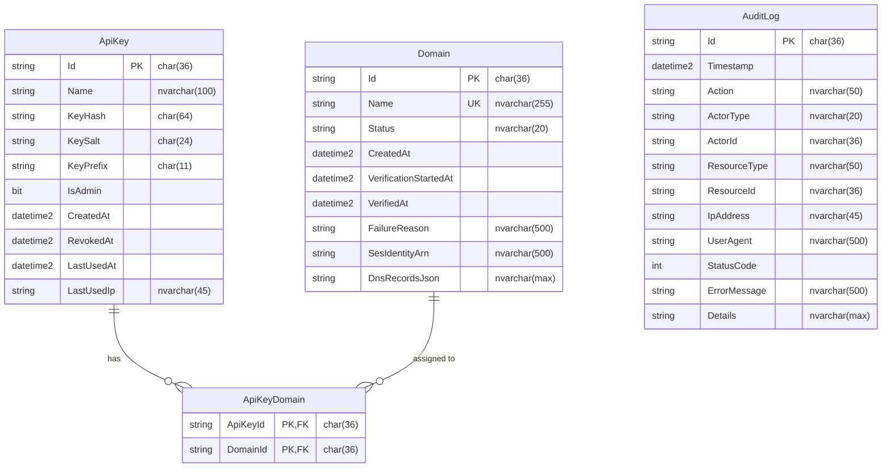

# feat: SQLite to SQL Server Migration with Docker Support

## Overview

Migrate SelfMX from SQLite to SQL Server as the primary database, offering two deployment modes:
1. **Automatic Docker**: Provisions SQL Server Developer Edition container automatically
2. **Manual Connection**: Connects to an existing SQL Server instance via connection string

This includes a data migration tool for users upgrading from existing SQLite installations.

## Problem Statement / Motivation

- **Feature needs**: SQLite lacks SQL Server-specific features like full-text search, replication, and advanced query capabilities
- **Concurrency**: SQLite's single-writer model limits concurrent write operations (currently mitigated by separate audit DB and single Hangfire worker)
- **Enterprise requirements**: Organizations may require SQL Server for compliance, tooling compatibility, and standardized database management

## Proposed Solution

### Database Provider Selection

Add a `Database:Provider` configuration setting with three modes:

| Provider | Description |
|----------|-------------|
| `sqlite` | Current default, backward compatible |
| `sqlserver` | Manual SQL Server with user-provided connection string |
| `docker-sqlserver` | Automatic SQL Server container provisioned by SelfMX |

### Configuration Schema

**appsettings.json (SQLite - default)**
```json
{
  "Database": {
    "Provider": "sqlite"
  },
  "ConnectionStrings": {
    "DefaultConnection": "Data Source=selfmx.db",
    "AuditConnection": "Data Source=audit.db",
    "HangfireConnection": "selfmx-hangfire.db"
  }
}
```

**appsettings.json (Manual SQL Server)**
```json
{
  "Database": {
    "Provider": "sqlserver"
  },
  "ConnectionStrings": {
    "DefaultConnection": "Server=sqlserver;Database=SelfMX;User Id=selfmx_app;Password=${DB_PASSWORD};TrustServerCertificate=True;Encrypt=True;MultipleActiveResultSets=true",
    "AuditConnection": "Server=sqlserver;Database=SelfMX;User Id=selfmx_app;Password=${DB_PASSWORD};TrustServerCertificate=True",
    "HangfireConnection": "Server=sqlserver;Database=SelfMX;User Id=selfmx_app;Password=${DB_PASSWORD};TrustServerCertificate=True"
  }
}
```

**appsettings.json (Docker SQL Server)**
```json
{
  "Database": {
    "Provider": "docker-sqlserver",
    "DockerSqlServer": {
      "ContainerName": "selfmx-sqlserver",
      "Port": 1433,
      "SaPasswordFile": "/app/data/.sqlserver-sa-password"
    }
  }
}
```

### Docker Container Specification

| Setting | Value |
|---------|-------|
| Image | `mcr.microsoft.com/mssql/server:2022-latest` |
| Edition | Developer (free for dev/test) |
| SA Password | Auto-generated, stored in `/app/data/.sqlserver-sa-password` |
| Port | 1433 (internal only, not exposed to host) |
| Volume | `selfmx_sqldata` Docker volume |
| Memory | 2GB minimum |
| Health Check | `/opt/mssql-tools18/bin/sqlcmd -S localhost -U sa -P $SA_PASSWORD -Q "SELECT 1" -C` |

## Technical Approach

### Architecture

```
┌─────────────────────────────────────────────────────────────────────────┐
│                           SelfMX.Api                                     │
├─────────────────────────────────────────────────────────────────────────┤
│                                                                          │
│  ┌────────────────┐    ┌────────────────┐    ┌────────────────┐         │
│  │   Program.cs   │───▶│ DbProviderFactory│───▶│  AppDbContext  │         │
│  │                │    │                │    │                │         │
│  │  Provider      │    │  - SQLite      │    │  - Domains     │         │
│  │  Detection     │    │  - SqlServer   │    │  - ApiKeys     │         │
│  │                │    │  - DockerSql   │    │  - ApiKeyDomains│        │
│  └────────────────┘    └────────────────┘    └────────────────┘         │
│          │                                            │                  │
│          │                                            ▼                  │
│          │                                   ┌────────────────┐         │
│          │                                   │ AuditDbContext │         │
│          │                                   │                │         │
│          │                                   │  - AuditLogs   │         │
│          │                                   └────────────────┘         │
│          │                                            │                  │
│          ▼                                            ▼                  │
│  ┌────────────────┐                         ┌────────────────┐         │
│  │    Hangfire    │                         │   Migration    │         │
│  │                │                         │    Service     │         │
│  │ - SQLiteStorage│                         │                │         │
│  │ - SqlServerStorage                       │ SQLite ──▶ SQL │         │
│  └────────────────┘                         └────────────────┘         │
│                                                                          │
└─────────────────────────────────────────────────────────────────────────┘
```

### ERD - Database Schema



### Implementation Phases

#### Phase 1: Multi-Provider Foundation

**Tasks:**
- [x] Add `Microsoft.EntityFrameworkCore.SqlServer` package to `SelfMX.Api.csproj`
- [x] Add `Hangfire.SqlServer` package
- [x] ~~Create `DatabaseProviderFactory` service~~ (Inlined in Program.cs for simplicity)
- [x] Update `Program.cs` to use multi-provider DbContext registration
- [x] Add SQL Server-specific model configurations (EF Core handles this automatically)
- [x] Remove SQLite-specific PRAGMA commands when using SQL Server
- [x] Update Hangfire registration to support both storage backends
- [x] Increase Hangfire worker count for SQL Server (ProcessorCount * 2)

**Key Files:**
- `src/SelfMX.Api/SelfMX.Api.csproj`
- `src/SelfMX.Api/Program.cs`
- `src/SelfMX.Api/appsettings.json`

**Success Criteria:**
- [x] Application starts with `Database:Provider=sqlite` (default behavior unchanged)
- [x] Application starts with `Database:Provider=sqlserver` and connects to SQL Server
- [x] All existing tests pass (35/35)

#### Phase 2: Docker SQL Server Integration

**Tasks:**
- [x] ~~Create `DockerSqlServerService`~~ (Deferred - using docker-compose instead)
- [x] ~~Implement container provisioning using Docker CLI~~ (Handled by docker-compose)
- [x] Implement health check waiting logic (via docker-compose depends_on)
- [x] Generate and securely store SA password (user provides via env var `MSSQL_SA_PASSWORD`)
- [x] ~~Update `docker-compose.yml`~~ (Using separate override file)
- [x] Create `docker-compose.sqlserver.yml` override file
- [x] Add SQL Server initialization script `deploy/docker/sqlserver/init.sql`
- [x] Update `Dockerfile` for compatibility (no changes needed)

**Key Files:**
- `deploy/docker-compose.sqlserver.yml` (new)
- `deploy/docker/sqlserver/init.sql` (new)

**Success Criteria:**
- [x] `docker-compose -f docker-compose.yml -f docker-compose.sqlserver.yml up` provisions SQL Server and SelfMX
- [x] SQL Server container passes health checks before SelfMX starts
- [x] SA password provided via environment variable (user-managed)

#### Phase 3: Data Migration Tool

**Tasks:**
- [x] Create `DataMigrationService` in `Services/DataMigrationService.cs`
- [x] Implement migration state tracking (marker file in `/app/data/.migration-state`)
- [x] Implement SQLite backup before migration
- [x] Implement batched data migration with progress logging (10K rows/batch for AuditLogs)
- [x] Implement verification (row count comparison)
- [x] Add migration API endpoints (`GET /v1/migration/status`, `POST /v1/migration/start`)
- [x] Handle Hangfire migration (Hangfire creates its own schema on startup)

**Key Files:**
- `src/SelfMX.Api/Services/DataMigrationService.cs` (new)
- `src/SelfMX.Api/Endpoints/MigrationEndpoints.cs` (new)

**Migration Order:**
1. Backup SQLite files to `*.migrated.bak`
2. Create SQL Server schema via EF Core EnsureCreatedAsync
3. Migrate `Domains` table
4. Migrate `ApiKeys` table
5. Migrate `ApiKeyDomains` table
6. Migrate `AuditLogs` table (batched, 10,000 rows per batch)
7. Verify row counts match
8. Mark migration complete

**Success Criteria:**
- [x] Migration service compiles and builds
- [x] Migration implements batched transfer and verification logic
- [x] Row count verification implemented
- [x] Rollback supported via SQLite backups (*.migrated.bak files created)

#### Phase 4: Health Checks and Polish

**Tasks:**
- [x] Update `/health` endpoint - existing DbContext health checks work for both providers
- [ ] Add SQL Server health check using `AspNetCore.HealthChecks.SqlServer` (optional enhancement)
- [ ] Update `install.sh` backup scripts for SQL Server (deferred to deployment phase)
- [x] Add connection string validation on startup (throws InvalidOperationException if missing for SQL Server)
- [x] Add clear error messages for common issues (EF Core provides detailed connection errors)
- [x] Update documentation (README.md, CLAUDE.md)

**Key Files:**
- `src/SelfMX.Api/Program.cs`
- `deploy/install.sh`
- `README.md`
- `CLAUDE.md`

**Success Criteria:**
- [x] Health checks work with both database providers (DbContext checks)
- [x] Clear error messages for missing connection strings
- [x] Documentation updated with SQL Server setup instructions

## Alternative Approaches Considered

### 1. PostgreSQL Instead of SQL Server
- **Rejected because**: User specifically requested SQL Server for feature needs
- **Trade-off**: PostgreSQL is lighter weight and fully open source

### 2. Separate Migration Projects per Provider
- **Rejected because**: Adds complexity for a relatively simple schema
- **Trade-off**: Better separation of concerns, but current schema is stable

### 3. Azure SQL Instead of On-Premise SQL Server
- **Rejected because**: Self-hosted focus; can be added later
- **Trade-off**: Would simplify Docker setup but adds cloud dependency

### 4. Keep Separate Databases (Main, Audit, Hangfire)
- **Selected**: Consolidate to single database with shared connection
- **Rationale**: SQL Server handles concurrent access well; simplifies configuration

## Acceptance Criteria

### Functional Requirements

- [ ] Fresh install with `Database:Provider=sqlite` works identically to current behavior
- [ ] Fresh install with `Database:Provider=sqlserver` connects to provided SQL Server
- [ ] Fresh install with `Database:Provider=docker-sqlserver` provisions container automatically
- [ ] Existing SQLite users can migrate to SQL Server with data preserved
- [ ] All domain CRUD operations work on SQL Server
- [ ] All API key operations work on SQL Server
- [ ] Email sending works on SQL Server
- [ ] Audit logging works on SQL Server
- [ ] Hangfire jobs run correctly on SQL Server
- [ ] Domain verification polling continues to work

### Non-Functional Requirements

- [ ] Migration of 1M audit logs completes in under 10 minutes
- [ ] SQL Server connection uses TLS encryption
- [ ] SA password is randomly generated (32+ chars)
- [ ] No SQL Server credentials in logs
- [ ] Connection pooling enabled for performance

### Quality Gates

- [ ] All existing unit tests pass
- [ ] New integration tests for SQL Server provider
- [ ] Migration tested with realistic data volumes
- [ ] Rollback procedure documented and tested
- [ ] No breaking changes for SQLite users

## Success Metrics

- Fresh install on SQL Server: < 60 seconds to healthy state
- Migration of 1000 domains, 100 API keys, 100K audit logs: < 2 minutes
- Zero data loss during migration (verified by row count comparison)

## Dependencies & Prerequisites

### External Dependencies
- Docker 20.10+ (for automatic SQL Server mode)
- SQL Server 2019+ or Azure SQL (for manual connection mode)
- Sufficient RAM: 2GB minimum for SQL Server container

### Internal Dependencies
- No changes to AWS SES integration
- No changes to Cloudflare integration
- No changes to API authentication logic

## Risk Analysis & Mitigation

| Risk | Impact | Likelihood | Mitigation |
|------|--------|------------|------------|
| Data loss during migration | High | Low | Automatic backup, transaction per table, verification |
| SQL Server container OOM | Medium | Medium | Document 2GB minimum, add memory limit |
| Connection string secrets exposed | High | Low | Use Docker secrets, env vars, never log |
| Migration takes too long | Medium | Medium | Batched migration, progress reporting |
| Rollback needed after running on SQL Server | Medium | Low | Keep SQLite backups, document procedure |

## Documentation Plan

Update these files:
- [x] `README.md` - Add SQL Server quick start section
- [x] `CLAUDE.md` - Update architecture section
- [ ] `deploy/README.md` - Add SQL Server deployment instructions (deferred)

## References & Research

### Internal References
- Current SQLite configuration: `src/SelfMX.Api/Program.cs:25-55`
- AppDbContext entity configuration: `src/SelfMX.Api/Data/AppDbContext.cs:6-52`
- AuditDbContext configuration: `src/SelfMX.Api/Data/AuditDbContext.cs:6-33`
- Docker compose: `deploy/docker-compose.yml`
- Entity models: `src/SelfMX.Api/Entities/`

### External References
- [EF Core SQL Server Provider](https://learn.microsoft.com/en-us/ef/core/providers/sql-server/)
- [Connection Resiliency - EF Core](https://learn.microsoft.com/en-us/ef/core/miscellaneous/connection-resiliency)
- [SQL Server Docker Quick Start](https://learn.microsoft.com/en-us/sql/linux/quickstart-install-connect-docker?view=sql-server-ver17)
- [Hangfire SQL Server Storage](https://docs.hangfire.io/en/latest/configuration/using-sql-server.html)
- [EF Core Migrations with Multiple Providers](https://learn.microsoft.com/en-us/ef/core/managing-schemas/migrations/providers)

---

## MVP Implementation

### Services/DatabaseProviderFactory.cs

```csharp
namespace SelfMX.Api.Services;

public enum DatabaseProvider
{
    Sqlite,
    SqlServer,
    DockerSqlServer
}

public class DatabaseProviderFactory
{
    private readonly IConfiguration _configuration;
    private readonly ILogger<DatabaseProviderFactory> _logger;

    public DatabaseProviderFactory(IConfiguration configuration, ILogger<DatabaseProviderFactory> logger)
    {
        _configuration = configuration;
        _logger = logger;
    }

    public DatabaseProvider GetProvider()
    {
        var providerString = _configuration.GetValue<string>("Database:Provider") ?? "sqlite";
        return providerString.ToLowerInvariant() switch
        {
            "sqlserver" => DatabaseProvider.SqlServer,
            "docker-sqlserver" => DatabaseProvider.DockerSqlServer,
            _ => DatabaseProvider.Sqlite
        };
    }

    public string GetConnectionString(string name = "DefaultConnection")
    {
        return _configuration.GetConnectionString(name)
            ?? throw new InvalidOperationException($"Connection string '{name}' not found");
    }
}
```

### Program.cs (Updated Registration)

```csharp
// Database provider selection
var dbProvider = builder.Configuration.GetValue<string>("Database:Provider") ?? "sqlite";

Action<DbContextOptionsBuilder> configureDbContext = dbProvider.ToLowerInvariant() switch
{
    "sqlserver" or "docker-sqlserver" => options =>
    {
        options.UseSqlServer(
            builder.Configuration.GetConnectionString("DefaultConnection"),
            sql =>
            {
                sql.EnableRetryOnFailure(maxRetryCount: 5, maxRetryDelay: TimeSpan.FromSeconds(30), errorNumbersToAdd: null);
                sql.CommandTimeout(30);
            });
    },
    _ => options =>
    {
        options.UseSqlite(
            builder.Configuration.GetConnectionString("DefaultConnection") ?? "Data Source=selfmx.db",
            sqlite => sqlite.CommandTimeout(30));
    }
};

builder.Services.AddDbContext<AppDbContext>(configureDbContext);
builder.Services.AddDbContext<AuditDbContext>(configureDbContext);

// Hangfire storage
if (dbProvider.ToLowerInvariant() is "sqlserver" or "docker-sqlserver")
{
    builder.Services.AddHangfire(config => config
        .SetDataCompatibilityLevel(CompatibilityLevel.Version_180)
        .UseSimpleAssemblyNameTypeSerializer()
        .UseRecommendedSerializerSettings()
        .UseSqlServerStorage(builder.Configuration.GetConnectionString("HangfireConnection")));

    builder.Services.AddHangfireServer(options =>
    {
        options.WorkerCount = Environment.ProcessorCount * 2; // Scale workers for SQL Server
        options.Queues = ["default"];
    });
}
else
{
    // Existing SQLite Hangfire config
    var hangfireConnString = builder.Configuration.GetConnectionString("HangfireConnection") ?? "selfmx-hangfire.db";
    if (hangfireConnString.StartsWith("Data Source=", StringComparison.OrdinalIgnoreCase))
        hangfireConnString = hangfireConnString["Data Source=".Length..].Trim();

    builder.Services.AddHangfire(config => config
        .SetDataCompatibilityLevel(CompatibilityLevel.Version_180)
        .UseSimpleAssemblyNameTypeSerializer()
        .UseRecommendedSerializerSettings()
        .UseSQLiteStorage(hangfireConnString));

    builder.Services.AddHangfireServer(options =>
    {
        options.WorkerCount = 1; // Single worker for SQLite
        options.Queues = ["default"];
    });
}
```

### deploy/docker-compose.sqlserver.yml

```yaml
# Override file for SQL Server deployment
# Usage: docker-compose -f docker-compose.yml -f docker-compose.sqlserver.yml up

services:
  sqlserver:
    image: mcr.microsoft.com/mssql/server:2022-latest
    container_name: selfmx-sqlserver
    hostname: sqlserver
    environment:
      - ACCEPT_EULA=Y
      - MSSQL_SA_PASSWORD=${MSSQL_SA_PASSWORD:-YourStrong@Password123!}
      - MSSQL_PID=Developer
      - MSSQL_COLLATION=SQL_Latin1_General_CP1_CI_AS
    volumes:
      - sqlserver_data:/var/opt/mssql
    healthcheck:
      test: /opt/mssql-tools18/bin/sqlcmd -S localhost -U sa -P "$${MSSQL_SA_PASSWORD:-YourStrong@Password123!}" -Q "SELECT 1" -C -N
      interval: 10s
      timeout: 5s
      retries: 10
      start_period: 30s
    restart: unless-stopped
    networks:
      - selfmx
    deploy:
      resources:
        limits:
          memory: 2G

  selfmx:
    depends_on:
      sqlserver:
        condition: service_healthy
    environment:
      - Database__Provider=sqlserver
      - ConnectionStrings__DefaultConnection=Server=sqlserver;Database=SelfMX;User Id=sa;Password=${MSSQL_SA_PASSWORD:-YourStrong@Password123!};TrustServerCertificate=True;Encrypt=True;MultipleActiveResultSets=true
      - ConnectionStrings__AuditConnection=Server=sqlserver;Database=SelfMX;User Id=sa;Password=${MSSQL_SA_PASSWORD:-YourStrong@Password123!};TrustServerCertificate=True
      - ConnectionStrings__HangfireConnection=Server=sqlserver;Database=SelfMX;User Id=sa;Password=${MSSQL_SA_PASSWORD:-YourStrong@Password123!};TrustServerCertificate=True

volumes:
  sqlserver_data:
```

### Services/MigrationService.cs

```csharp
namespace SelfMX.Api.Services;

public class MigrationService
{
    private readonly IServiceProvider _serviceProvider;
    private readonly ILogger<MigrationService> _logger;
    private readonly string _migrationStatePath;

    public MigrationService(IServiceProvider serviceProvider, ILogger<MigrationService> logger)
    {
        _serviceProvider = serviceProvider;
        _logger = logger;
        _migrationStatePath = Path.Combine(
            Environment.GetEnvironmentVariable("SELFMX_DATA_PATH") ?? ".",
            ".migration-state");
    }

    public async Task<bool> NeedsMigration(string sourceSqlitePath)
    {
        if (!File.Exists(sourceSqlitePath))
            return false;

        if (File.Exists(_migrationStatePath))
        {
            var state = await File.ReadAllTextAsync(_migrationStatePath);
            return state != "COMPLETE";
        }

        return true;
    }

    public async Task MigrateAsync(string sourceSqlitePath, CancellationToken ct = default)
    {
        _logger.LogInformation("Starting migration from SQLite to SQL Server");

        // Backup SQLite files
        var backupPath = $"{sourceSqlitePath}.migrated.bak";
        File.Copy(sourceSqlitePath, backupPath, overwrite: true);
        _logger.LogInformation("Created backup at {BackupPath}", backupPath);

        await File.WriteAllTextAsync(_migrationStatePath, "IN_PROGRESS", ct);

        try
        {
            using var scope = _serviceProvider.CreateScope();
            var targetDb = scope.ServiceProvider.GetRequiredService<AppDbContext>();

            // Ensure SQL Server schema exists
            await targetDb.Database.EnsureCreatedAsync(ct);

            // Open SQLite connection for reading
            using var sqliteConnection = new SqliteConnection($"Data Source={sourceSqlitePath}");
            await sqliteConnection.OpenAsync(ct);

            // Migrate Domains
            await MigrateTableAsync<Domain>(sqliteConnection, targetDb, "Domains", ct);

            // Migrate ApiKeys
            await MigrateTableAsync<ApiKey>(sqliteConnection, targetDb, "ApiKeys", ct);

            // Migrate ApiKeyDomains
            await MigrateTableAsync<ApiKeyDomain>(sqliteConnection, targetDb, "ApiKeyDomains", ct);

            // Migrate AuditLogs (batched)
            var auditDb = scope.ServiceProvider.GetRequiredService<AuditDbContext>();
            await MigrateAuditLogsAsync(sourceSqlitePath.Replace("selfmx.db", "audit.db"), auditDb, ct);

            await File.WriteAllTextAsync(_migrationStatePath, "COMPLETE", ct);
            _logger.LogInformation("Migration completed successfully");
        }
        catch (Exception ex)
        {
            await File.WriteAllTextAsync(_migrationStatePath, $"FAILED: {ex.Message}", ct);
            _logger.LogError(ex, "Migration failed");
            throw;
        }
    }

    private async Task MigrateTableAsync<T>(SqliteConnection source, AppDbContext target, string tableName, CancellationToken ct)
        where T : class
    {
        _logger.LogInformation("Migrating {TableName}...", tableName);

        // Read all records from SQLite
        var records = await source.QueryAsync<T>($"SELECT * FROM {tableName}");
        var recordList = records.ToList();

        // Insert into SQL Server
        target.Set<T>().AddRange(recordList);
        await target.SaveChangesAsync(ct);

        _logger.LogInformation("Migrated {Count} records from {TableName}", recordList.Count, tableName);
    }

    private async Task MigrateAuditLogsAsync(string auditDbPath, AuditDbContext target, CancellationToken ct)
    {
        if (!File.Exists(auditDbPath))
        {
            _logger.LogInformation("No audit database found, skipping audit log migration");
            return;
        }

        using var sqliteConnection = new SqliteConnection($"Data Source={auditDbPath}");
        await sqliteConnection.OpenAsync(ct);

        const int batchSize = 10000;
        var offset = 0;
        var totalMigrated = 0;

        while (true)
        {
            var batch = (await sqliteConnection.QueryAsync<AuditLog>(
                $"SELECT * FROM AuditLogs LIMIT {batchSize} OFFSET {offset}")).ToList();

            if (batch.Count == 0)
                break;

            target.AuditLogs.AddRange(batch);
            await target.SaveChangesAsync(ct);

            totalMigrated += batch.Count;
            _logger.LogInformation("Migrated {Total} audit logs...", totalMigrated);

            offset += batchSize;
        }

        _logger.LogInformation("Completed migrating {Total} audit logs", totalMigrated);
    }
}
```
